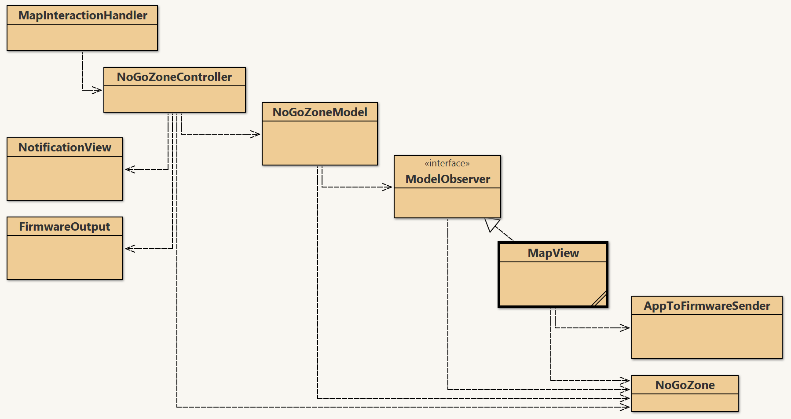

### Lab 3-4 report and software feedback team 13 A

#### General Remarks
- **Software rejected, since unusable**, 
- **Report rejected, substance not sufficient**
- *Please, deliver substantially improved work within a week*

#### Softrare
- No executable program, i.e. no demonstrator provided.
- No MVC-pattern, neither correct observer pattern (this requires registering, namely the view when user choses the UC, and the robot boundary when the robot is ready  for communication), nor any other pattern required by lab task description.
- Just UC 15 indicated, UC-cluster-demo including other UC missing

#### Report
- Contribution of each of the two team members is not well indicated in the report.
- Only UC 15 instead of Lab 3 UC-cluster including UC 11 or other is covered.
- Your UC15 description is deprecated, does not concentrate on the app.
- Sequence diagram is based on domain/class model that is missing relevant parts, e.g. 
- which concept will be responsible for providing the basic map with coordinate system? 
- which concept will instantiate the polygon then on what basis
- which concept will receive user input that nogoozone-editing is finished?
- observer of the finalized model is not only the view but also the firmware boundary concept when robot is online available
- user will get displayed cleaning progress including robot state all the time, not only by the end of the cleaning process.
- Design patterns as described in software part above are missing.

#### BlueJ Class Diagram
- make it clean as explained in the lecture!
- here the one for your current classes

Dear Professor Renz,

Thank you very much for your detailed feedback on our Lab 3–4 report and software. We are currently working on substantial improvements and would like to share our correction plan to ensure alignment with your expectations.

## Team 13A – Correction Plan for Lab 3–4

### Class Diagram (BlueJ) – *Cindy*
- Reworking the class diagram based on your reference (`WR_UC15_bluej.png`).
- The updated version will follow a clean structure as discussed in the lecture.
- Improvements will incorporate proper design patterns (MVC, Observer and Decorator).

### Sequence Diagram – *Larissa*
- Revising the diagram to:
  - Include the concept responsible for the **map with coordinate system**.
  - Show how the **polygon (No-Go Zone)** is instantiated via `onZoneDrawn`.
  - Indicate that **MapHandler** receives input when zone editing is finished.
  - Add correct **observers**: `NotificationView`, `MapView`, and `AppToFirmwareSender`.
  - Ensure **asynchronous cleaning progress** and robot state updates are clearly modeled.

### Software Implementation
- **UC-15 (No-Go Zone)** and **UC-13 (Review Logs)** are completed.
- Current tasks:
  - Fully implement **UC-11, UC-12, UC-14, and UC-16** to complete the cluster.
  - UC-14: Implement configuration via app interface.
  - Re-implement **MVC pattern** (*Cindy*) and **Observer pattern** (*Larissa*).
  - Provide an executable demo aligned with lab requirements.

### Report Revision
- Indicate **individual contributions** of team members.
- Update the **UC-15 description** to focus on the app context (*Cindy*).
- Expand report to cover full **UC Cluster (UC-11 to UC-16)**.
- Describe and reference the **design patterns** implemented.
- Update sequence and class diagrams accordingly.

We are fully committed to improving the report and software, and will submit the final version **by the end of this week** as requested.  
Please let us know if there’s anything else we should clarify or adjust.

Thank you once again for your guidance and support.

Best regards,  
**Larissa Ayumi Okabayashi**  
*on behalf of Team 13A*