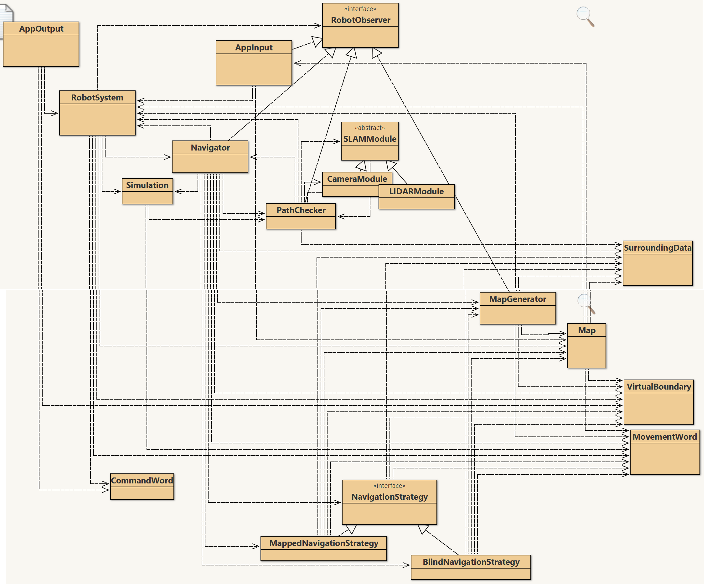

Hi Brian, 

appended at the bottom you find some debugging info that I do not eally understand.

In particular there is lot of dead code, looks far too complex compared to the output produced.
In particular, question is why navigation strategy (neither blind nor guided) does get applied (I put some printing there as well.)
Also the observerpattern seams not really relevant.

After a little refactoring, my bluej class diagram looks as follows:



```
AppOutput appOutpu1 = new AppOutput();
appOutpu1.handleCommand("start");
Cleaning  start.
initial data sending
x:0 y:0 val:1
x:0 y:3 val:1
x:0 y:1 val:1
x:7 y:1 val:1
x:2 y:1 val:0
processing move 1
x:3 y:0 val:1
x:3 y:3 val:1
x:0 y:1 val:1
x:7 y:1 val:1
x:3 y:1 val:0
processing move 2
x:4 y:0 val:1
x:4 y:3 val:1
x:0 y:1 val:1
x:7 y:1 val:1
x:4 y:1 val:0
processing move 3
x:5 y:0 val:1
x:5 y:3 val:1
x:0 y:1 val:1
x:7 y:1 val:1
x:5 y:1 val:0
processing move 4
x:6 y:0 val:1
x:6 y:3 val:1
x:0 y:1 val:1
x:7 y:1 val:1
x:6 y:1 val:0
processing move 5
x:6 y:0 val:1
x:6 y:3 val:1
x:0 y:2 val:1
x:7 y:2 val:1
x:6 y:2 val:0
processing move 6
x:5 y:0 val:1
x:5 y:3 val:1
x:0 y:2 val:1
x:7 y:2 val:1
x:5 y:2 val:0
processing move 7
x:4 y:0 val:1
x:4 y:3 val:1
x:0 y:2 val:1
x:7 y:2 val:1
x:4 y:2 val:0
processing move 8
x:3 y:0 val:1
x:3 y:3 val:1
x:0 y:2 val:1
x:7 y:2 val:1
x:3 y:2 val:0
processing move 9
x:2 y:0 val:1
x:2 y:3 val:1
x:0 y:2 val:1
x:7 y:2 val:1
x:2 y:2 val:0
processing move 10
x:1 y:0 val:1
x:1 y:3 val:1
x:0 y:2 val:1
x:7 y:2 val:1
x:1 y:2 val:0
processing move 11
x:1 y:0 val:1
x:1 y:3 val:1
x:0 y:1 val:1
x:7 y:1 val:1
x:1 y:1 val:0
processing move 12
x:2 y:0 val:1
x:2 y:3 val:1
x:0 y:1 val:1
x:7 y:1 val:1
x:2 y:1 val:0
x:1 y:1 val:4
x:2 y:1 val:4
x:3 y:1 val:4
x:4 y:1 val:4
x:5 y:1 val:4
x:6 y:1 val:4
x:1 y:2 val:4
x:2 y:2 val:4
x:3 y:2 val:4
x:4 y:2 val:4
x:5 y:2 val:4
x:6 y:2 val:4
update received by Navigator
update received by MapGenerator
update received by PathChecker
update received by AppInput
4 1 1 1 1 1 1 4 
1 0 2 0 0 0 0 1 
1 0 0 0 0 0 0 1 
4 1 1 1 1 1 1 4
```