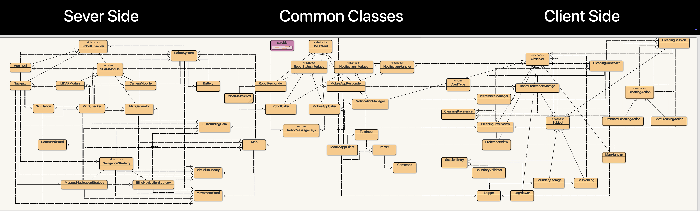
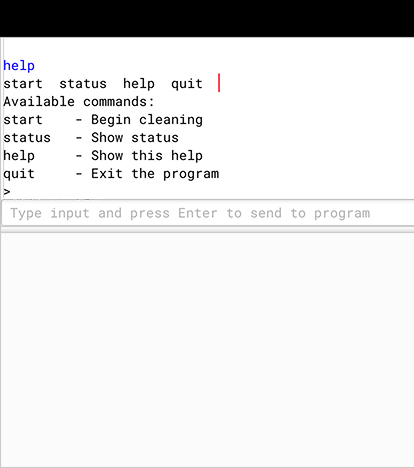

# Robot Vacuum Cleaner System  
**Team Members**: Cindy Um, Lari Okabayashi, Brian Im  

**Software Engineering Lab Project**  
*Hochschule für Angewandte Wissenschaften Hamburg (HAW Hamburg)*  

Developed as part of the **Software Engineering** curriculum at HAW Hamburg, this project demonstrates a distributed system using:  
- **JMS (Java Message Service)** for asynchronous messaging  
- **Client-Server architecture** with ActiveMQ middleware  
- **Design patterns** (Observer, Strategy, etc.) for modularity  

## Table of Contents  
1. [Introduction](#1-introduction)  
2. [System Overview](#2-system-overview)  
3. [Architecture Design](#3-architecture-design)  
   - [Server & Client Roles](#31-server-and-client-roles)  
   - [Core Components](#32-core-components)  
4. [Communication Flow](#4-communication-flow)  
5. [Implementation Details](#5-implementation-details)  
   - [BlueJ Class Diagram](#51-bluej-class-diagram)  
   - [JMS & ActiveMQ Integration](#52-jms--activemq-integration)  
6. [Demonstrator I/O](#6-demonstrator-input-and-output)  
7. [Appendices](#7-appendices)  

---

### 1. Introduction  
This system implements a **JMS-based Client-Server (C-S) demonstrator** for a robot vacuum cleaner, replacing an earlier RMI prototype ([RMI BlueJ Code](./RMI%20Robot%20Vacuum/)). Key features:  
- Asynchronous messaging via **Java Message Service (JMS)** and **Apache ActiveMQ**.  
- Decoupled communication between robot firmware (server) and mobile app (client).  

---

### 2. System Overview  
  
Three main components:  
1. **Firmware**: Robot hardware controller (server).  
2. **Mobile App**: User interface for remote control (client).  
3. **Middleware**: JMS messaging backbone.  

---

### 3. Architecture Design  
#### 3.1 Server and Client Roles  
| **Role**         | **Component**       | **Responsibilities**                          |  
|------------------|---------------------|-----------------------------------------------|  
| **Server**       | Robot Firmware      | Executes commands, manages robot state.       |  
| **Client**       | Mobile Application  | Sends commands, receives status/notifications.|  

#### 3.2 Core Components  
**Shared Classes**:  
- `RobotMessageKeys` (Message types enum)  
- `RobotStatus` (DTO for robot state)  
- Interfaces:  
  - `RobotStatusInterface` (Client→Server commands)  
  - `NotificationInterface` (Server→Client events)  
  - `NotificationHandler` (Observer pattern for updates)  

**Server Side**:  
- `RobotResponder`: Handles client commands (e.g., `startCleaning()`).  
- `RobotCaller`: Sends async notifications (e.g., `notifyLowBattery()`).  

**Client Side**:  
- `AppCaller`: Invokes server commands.  
- `AppResponder`: Listens for server notifications.  

**Code Snippets**:  
```java
// Example: RobotStatus DTO
public class RobotStatus implements Serializable {
    private String currentMode; // e.g., "Cleaning", "Docked"
    private int batteryLevel;   // 0-100%
    // ... (getters/setters)
}
```

---

### 4. Communication Flow  
1. **Client→Server**: Commands like `START_CLEANING` → `RobotResponder`.  
2. **Server→Client**: Notifications like `BATTERY_LEVEL_UPDATE` → `AppResponder`.  

---

### 5. Implementation Details  
#### 5.1 BlueJ Class Diagram  
  
- **Left**: Server-side (Robot Firmware).  
- **Middle**: Shared interfaces/DTOs.  
- **Right**: Client-side (Mobile App).  
[View BlueJ Code](./JMS%20Robot%20Vacuum/)  

#### 5.2 JMS & ActiveMQ  
- Replaced RMI with JMS for async, reliable messaging.  
- ActiveMQ as the message broker.  

---

### 6. Demonstrator Input and Output  
#### GUI Screenshot (Mobile App)  
  

#### Terminal Outputs  
| **Side**   | **Command** | **Output**                                  |  
|------------|------------|---------------------------------------------|  
| Client     | `start`    | Sends `StartCleaning` → receives status updates. |  
| Server     | -          | Logs robot movements/battery changes.       |  

[Demo Video](./images/demo.mp4)  

---

### 7. Appendices  
#### A. SE Glossary  
| Term           | Description                                  |  
|----------------|----------------------------------------------|  
| Observer Pattern | Decouples event sources (e.g., robot) from subscribers (e.g., app). |  
| Strategy Pattern | Enables runtime algorithm switching (e.g., cleaning modes). |  

#### B. AI Support  
- **Prompt**: "Convert this lab explanation into academic markdown with sections for architecture, components, and workflows."  
- **Tools Used**: For formatting and terminology consistency.  
