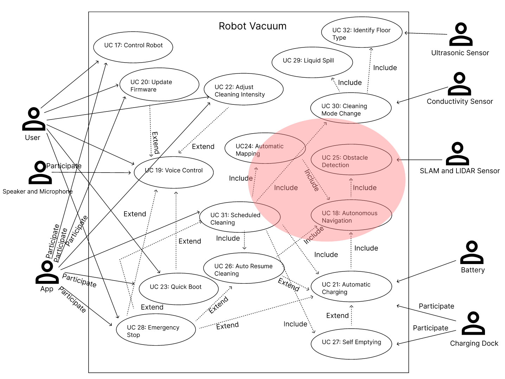
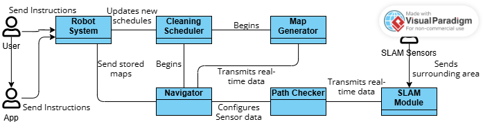
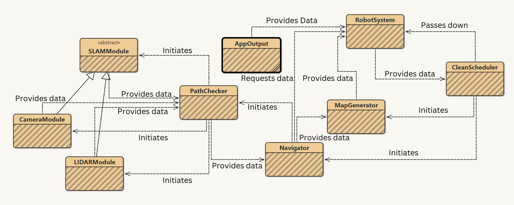
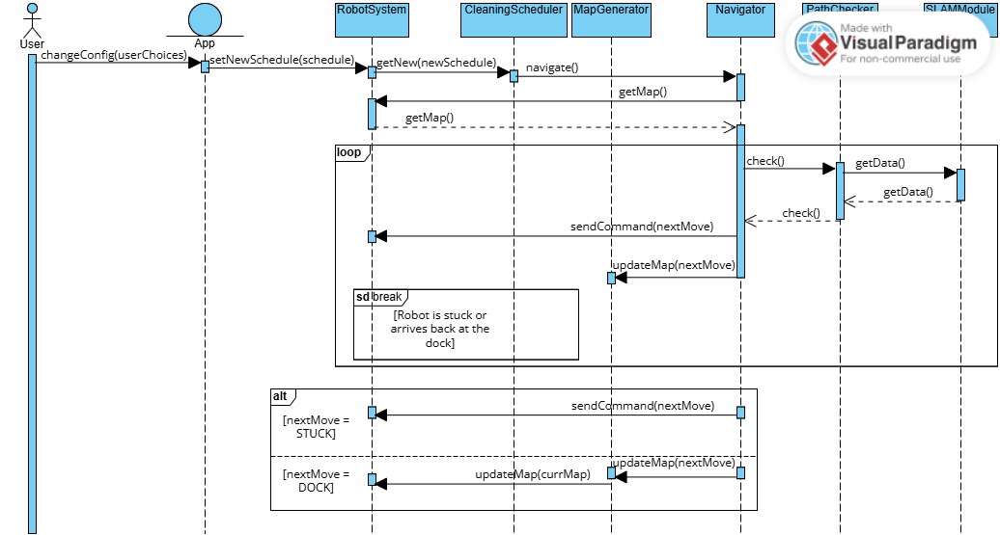
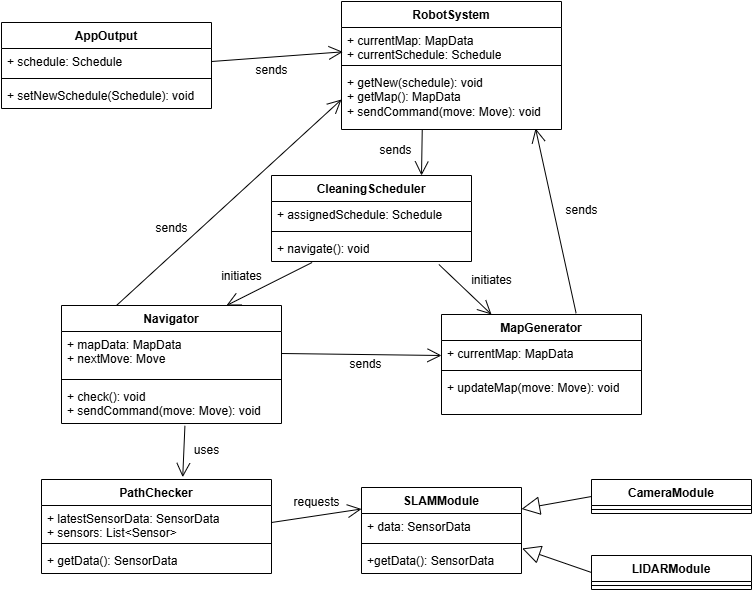

# Software Engineering (SE) Lab 3 Report on Detailed Design of App OR Firmware UC cluster

### Authors

| Family name | First name(s) | Student ID | *Partner A or B* |  
| --- | --- | --- | --- |
| Im | Brian | 2827056 | Partner B (Robot Firmware)|
| ... | Fazel | ... | Partner B (Robot Firmware)|

### Version 
WIP (work in progress)

**Deadlines for this document**

- lab 3 preparation: Monday, May 12, earlier PREP appreciated
- lab 3 final version: Monday, May 19, earlier FINAL appreciated

***Prerequisites:***

| What you check/do now | Why and for what pupose |
 | --- | --- |
| Domain modelling slide set accessed | *lecture 4b contains Slides on Ivan Marsic's domain analysis, tracabilityy matrix (2) etc.*| 
| UC slide set accessed | *UC clusters to be identified"  |
| git pulled | get last version of your partners work
| report 3 pushed | this document renamed and pushed by one of the partners |

**"SE-lab3-Report_*team-Number_AorB_names-of-the-two*"**, upload it (first time by one partner) to gitlab or pull it (later) and commit changes continuously! 

***Tasks***:
- Fulfill Prerequisites (above) **FIRST**!
- New team of partners A OR B provides an original report without plagiarism, see Appendix B and regulations on lab 1 task sheet!
- Transfer suitable content from lab 2: New team members compare their lab 2 final reports on App OR Firmware, identify problems, improve them and decide for a common basis for this lab, i.e. take lab 2 work, refine it and paste it in section 1 of this document.

## Glossary

*This glossary only contains terms related to the application domain. A glossary of SE-related terms is placed into appendix A*

| Term | Acronym | Description |  
| --- | --- | --- |
| Robot Mower | RM | Robotic Lawn Mower |
| Robot Vacuum | RV | Robotic Vacuum Cleaner |
| ... | ... | ... |

## 1. Base documents

### 1a. UC diagram

*Refined UC diagram with your UC-cluster indicated e.g. by color*

*Shortly describe the way you improve and  decide.*

 

The UC cluster which has been chosen to focus upon is the Navigation Process -> UC-18, UC-24, UC-25. It has been highlighted by the red colour in the diagram. This cluster has a functional similarity in how it controls the movement of the robot vacuum as it is cleaning.

## 1b. Detailed UC Descriptions

*Refined Detailed UC Descriptions of UCs in your UC-cluster*

*Shortly describe the way you improve and  decide.*

The refinements made to the detailed uc descriptions were focused on making sure all the responses from the firmware aligns with every scenario. The extensions all include very clear and specific cases, accounting for all reasonable outcomes for a robot vacuum's use cases. Additionally, more precise wording was used to reduce ambiguity in the firmware's deicision making process. This ensures that the robot’s behavior is predictable, efficient, and adaptable to various real-world situations within these UC descriptions.

#### Refined UC-18: Autonomous Navigation 

- **Related Requirements**: REQ-2, REQ-3, REQ-6, REQ-23, REQ-26, REQ-36
- **Initiating Actor**: UC-26 Auto Resume Cleaning
- **Goal**: Cover all areas of the floor for cleaning.
- **Participating Actors**: None
- **Preconditions**: Robot has a scheduled clean currently.
- **Postconditions**: All the floors have been cleaned.

**Flow of Events:**
1. → UC-26 initiates cleaning.
2. ← Checks the map of the floor available to identify area.
3. ← Calculates best direction to move to cover all the areas the most efficiently.
4. → UC-25 gives back confirmation of a clear path.
5. ← Robot continues calculating and confirming paths (steps 3-4) until all areas are cleaned.

**Extensions (Alternate Scenarios):**
2a. No map exists
1. ← Send instruction to scan all the surrounding area to build a map.
2. → Recive information on which paths are clear.
3. ← Send information on path followed whilst repeating steps 1 and 2.
4a. No clear path
1. ← Send a check for alternative paths. 
2. → Can go down that path.
3. ← Continue on original process.
 <ensp> 2a. No alternative paths. ← Robot stops. ← Notify robot there is no path.

#### Refined UC-24: Automatic Mapping 

- **Related Requirements**: REQ-2, REQ-3, REQ-23
- **Initiating Actor**: UC-31 Scheduled Cleaning
- **Goal**: Create and store a map of the cleaning area.
- **Participating Actors**: None
- **Preconditions**: Robot has a scheduled clean currently.
- **Postconditions**: A completed map of the clean is transmitted to the robot vacuum storage system.

**Flow of Events:**
1. → UC-31 notifies of a clean beginning.
2. ← Instruct UC-18 to create an efficient path.
3. → Receive followed path during clean.
4. ← Combine given path information to create a complete map.
5. ← Transfer map information to robot vacuum.

**Extensions (Alternate Scenarios):**
3a. No path available, robot stops moving.
1. ← Notify robot and user that robot is stuck.

#### Refined UC-25: Obstacle Detection 

- **Related Requirements**: REQ-2, REQ-6, REQ-23, REQ-36
- **Initiating Actor**: Robot Sensor
- **Goal**: Detect obstacles and determine whether they are movable.
- **Participating Actors**: None
- **Preconditions**: Robot is on and currently cleaning or moving.
- **Postconditions**: Obstacle status is determined and path is either cleared or marked as blocked.

**Flow of Events:**
1. → Sensor detects an obstruction in the path.
2. ← Robot applies light pressure to the object.
3. → Object does not move.
4. ← Firmware flags the location as containing a confirmed obstacle.

**Extensions (Alternate Scenarios):**
3a. Object shifts from the slight pressure.
1. ← The robot keeps lightly pushing the object.
2. → Object slips away to the side not blocking the path anymore.
 <ensp>  2a. Object does not slip away. ← Firmware flags the location as containing a confirmed obstacle.
1. ← Robot continues on its original path.

## 1c. Activity Diagrams

*Copy your lab 2 Activity Diagrams here*

*Shortly describe if you still consider all or parts of them relevant for this labs work.*

The Activity Diagram for UC-25, Obstacle Detection, is within the chosen use case cluster and is still relevant as it follows the same general logical structure that the updated extended use case descriptions follow. However the UC-21 Automatic Charging activity diagram is outside the range of the cluster we are following and only has loose connections with UC-18 Autonomous Navigation.

##### Activity Diagram for UC-21: Automatic Charging

##### Activity Diagram for UC-25: Obstacle Dectection

## 2. First sketch and list of concepts for your domain model

*In the sketch, draw associations*

*in the list, give base responsibility of concept, i.e. prototypic class*

*Identify questions to be discussed* 

#### 2.1 Sketch (Domain Model)

#### 2.2 Concept List and Base Responsibilities (Prototypic Class)

| **Concept**         | **Base Responsibility (Prototypic Class)**                                                 |
|---------------------|---------------------------------------------------------------------------------------------|
| `User`           | Represents a human user who interacts with and controls the robot vacuum                    |
| `App`       | Relays user commands and configuration updates from the digital interface      |
| `RobotController`       | Acts as the central controller and orchestrates and stores the behaviour and maps       |
| `CleaningScheduler`       | Stores currently set cleaning schedules and initiates cleaning during valid times     |
| `MapGenerator`  | Receives information on the robot's path to create a full valid map of the cleaning area          |
| `Navigator`    | Receives information on current location of robot and surrounding area to determine most efficient next path                        |
| `PathChecker`      | Compiles data from all the sensors to correctly determine if the current path is blocked       |
| `SLAMModule`      | Transmits information from various SLAM sensors of the robot       |
| `SLAMSensor`      | Physical sensor of varying types, such as cameras, LIDAR sensor, radar, sonar or IMUs      |

## 3. Refined tables of Responsibility, Associations and Properties

*As described in the lab taks sheet, I can recommend to use BlueJ for refining your paperwork of section 2 and finally extract all information for the tables from class javadoc and fields.*

| **Concept Name**         | Type | **Responsibilities**                                                 |
|---------------------|------|---------------------------------------------------------------------------------------------|
| `App`       |  K   | Stores and relays user commands and configuration updates from the digital interface       |
| `RobotSystem`       |  K   | Acts as the central controller and orchestrates and stores the behaviour       |
| `CleaningScheduler`       |  K   | Stores currently set cleaning schedules and initiates cleaning during valid times     |
| `MapGenerator`  |  D   | Receives information on the robot's path to create a full valid map of the cleaning area          |
| `Navigator`    |  D   | Receives information on current location of robot and surrounding area to determine most efficient next path                        |
| `PathChecker`      |  D   | Compiles data from all the sensors to correctly determine if the current path is blocked       |
| `SLAMModule`      |  D   | Transmits information from SLAM sensors of the robot       |

| **Concept Pair**           | **Description**     | **Association**                           |
|---------------------|--------------------------|----------------------------------------------------------------|
| `App` ↔ `RobotSystem` | `App` stores and relays user commands and configuration changes to `RobotSystem` | provides data |
| `RobotSystem` ↔ `CleaningScheduler` | `RobotSystem` receives new cleaning schedules and sends it to `CleaningScheduler` | provides data |
| `CleaningScheduler` ↔ `MapGenerator` | `CleaningScheduler` prepares `MapGenerator` to listen to `Navigator` to create a new map | initiates |
| `CleaningScheduler` ↔ `Navigator` | `CleaningScheduler` beings `Navigator` by informing them during cleaning schedules | initiates |
| `Navigator` ↔ `MapGenerator` | `Navigator` sends real-time navigation directions and movements to `MapGenerator` to create a new map | provides data |
| `Navigator` ↔ `RobotSystem` | `Navigator` requests for the most recent valid map and `RobotSystem` responds by sending a map if it exists, otherwise nothing | conveys request |
| `Navigator` ↔ `PathChecker` | `Navigator` informs `PathChecker` that it is actively requests real-time information | conveys request |
| `PathChecker` ↔ `SLAMModule` | `PathChecker` receives sensor data from all `SLAMModule` and compiles the data to detect all nearby obstacles | provides data |

| **Concept**         | **Attributes**     | **Attribute Descriptions**                                                 |
|---------------------|--------------------|----------------------------------------------------------------------------|
| `AppOutput`       | `user commands`     | Represents actions like start, stop, pause, or mode changes   |
|           | `configuration changes`  | Data for schedule modifications, cleaning modes, area selections and other user preferences |
| `RobotOutput` | `stored maps` | Most recently updated maps of the enviornment |
| `RobotSystemData`       | `stored maps`     | Pre-existing maps of the environment used to assist navigation and planning |
|   | `received commands`| Commands and instructions relayed from the App |
|   | `scheduling information` | Details of currently set cleaning schedules and user preferences |
|   | `status` | Current robot action status and command |
| `CleaningSchedule` | `time` | When to clean |
|  | `area` | Specific areas of the map to clean at given times if allocated by user | 
|  | `user preferences` | Cleaning type preferences selected by user according to area |
| `MapData` | `spacial layout` | Represents the physical map of the enviornment accessed by the robot vacuum |
|  | `cleaning zones` | Preset zones for cleaning which can be edited and selected by the user for special preferences |
|  | `map version  ` | Identifies map version and whether it is current` |
| `NavigationData` | `current position` | Robot's real-time location in the mapped environment if available |
|  | `planned path` | Path for robot to follow made using previously valid maps if available |
| `PathValidation` | `obstacle` | Data on where obstacles are identified nearby' |
| `SensorData` | `environment scan` | Data from various SLAM Modules on current scan of the environment |
|  | `obstacle distances` | Proximity of objects which have been identified on sensors |

## 4. Domain model diagram

*Prototypic class diagram with associations and properies.*

*Best edit your class diagram in BlueJ (best make arrows point right down), then take a screenshot and annotate associations to the arrows*

*Alternatively draw it by Visual Paradigm or other tool*

## 5. Tracability Matrix (2)

*Relates concepts to UCs*

## 6. Sketch of a sequence diagram

*Indicate dynamic behavior by event walk-through that indicates what your UC-demonstrator will do when events are generated by initiating actors*

This diagrams follows the dynamic behaviour of the chosen Use Case cluster. The scenario below follows the situation where a user changes the cleaning schedule for the robot to the current time. Therefore it follows how the firmware responds to when it is scheduled to clean.

#### Event Walk-Through:

1. The system starts when the `User` sends a change of schedule and other configuration changes through the App.

2. The `App` processes the user's input and relays the structured data to the `RobotSystem`.

3. The `RobotSystem` receives the command and forwards the relevant scheduling information to the `CleaningScheduler`.

4. As the time is changed to the current time as stated in the initial condition, the `CleaningScheduler` initiates the cleaning operation by instructing the `Navigator` to start planning a cleaning path.

5. The `Navigator` queries the `RobotSystem` for the most recent valid MapData to ensure accurate path planning. 

6. If an up-to-date map exists, the `RobotSystem` responds with the map data.

7. The `Navigator` then requests real-time path validation from the `PathChecker` to ensure that the planned path is safe and obstacle-free.

8. The `PathChecker` gathers environmental scan data from various `SLAMModule` sensors (e.g., LIDAR, cameras). This data includes obstacle locations and distances.

9.  Based on the compiled sensor data from the `SLAMModule`, the `PathChecker` returns path validation results to the `Navigator`, highlighting any detected obstacles.

10. The `Navigator` sends updated movement and path information to the `RobotSystem` after confirming the valid path which is able to execute commands to the hardware.

11. The `Navigator` sends the same movement and path information to the `MapGenerator` as the robot progresses, allowing the MapGenerator to refine and update the environment map in real-time.

12. Steps `7` to `11` are repeated until the robot is stuck or returns to the dock.

13. If the robot is stuck, send a message to the `RobotSystem` that it is stuck.

14. If the robot is back at the dock, the `Navigator` alerts `MapGenerator`, which sends the completed new MapData to the `RobotController`. 

This sequence captures the collaborative flow between user interaction, firmware system control, navigation, mapping, and sensor data processing, ensuring a cohesive and intelligent navigation system.

#### UML Sequence Diagram

## 6. Class diagram with Methods

### Design Patterns

#### 6a. Observer Pattern

**Participants:**
`Navigator`, `MapGenerator`, `AppInput`, `PathChecker`, `RobotSystem`

**Description:**
`RobotSystem` stores `Navigator`, `AppInput`, `PathChecker` and `MapGenerator` as observer objects to be notified when a clean has been completed. This allows for easy moditications on which classes are notified while keeping their execution synchronous but logically separate.

#### 6b. Strategy Pattern

**Participants:**
`Navigator`, `RobotSystem`

**Description:**
`Navigator` requests `RobotSystem` for available map data. Depending on whether the `RobotSystem` returns a valid map the `Navigator` selects either a Map Strategy or a No Map Strategy. These two strategies, as subclasses of Strategy, contain different algorithms and handle the movement behaviours of the robot. This approach allows the `Navigator` to dynamically adapt to different contexts, ensuring flexible movement logic.

#### 6c. Singleton Pattern

**Participants:**
`RobotSystem`, `MapGenerator`, `Navigator`, `PathChecker`

**Description:**
These four classes only require a singular instance for proper functionality of the robot vacuum firmware. These classes represent core subsystems that should never exist in duplicate to avoid state conflicts or duplication of effort. Additionally solves the issue of having classes store instances of other classes to send information and requiring the passthrough of itself when constructing other classes.

### Covered Use Cases
#### Previously Covered Use Cases
UC-18: Autonomous Navigation 
 UC-24: Automatic Mapping 
 UC-25: Obstacle Detection 
 These Use Cases are mostly unaffected from the changes made with the patterns and mostly applicable to the UC demonstrator.
#### Extended UC Description of New Covered Use Case
#### Refined UC-31: Scheduled Cleaning

- **Related Requirements**: REQ-3, REQ-6
- **Initiating Actor**: App
- **Goal**: Robot begins cleaning automatically at the scheduled time and location.
- **Participating Actors**: None
- **Preconditions**: Robot is docked and charged. The robot has done an initial clean to map area.
- **Postconditions**: Cleaning begins at scheduled time and Robot avoids designated locations on the map.

**Flow of Events:**
1. → Mobile app sends a new clean schedule to Robot.
2. ← Firmware checks time, battery level and dock status.
3. ← Firmware confirms current location and map data availability.
4. ← include::Autonomous Navigation(UC-18). 
5. ← Robot concludes cleaning and returns to the dock.

**Extensions (Alternate Scenarios):**
2a. Battery too low.
1. ← Robot delays cleaning and sends notification to app.
2. ← Waits to charge.
3. ← Proceed with original flow of events step 2.s
3a. Map data unavailable.
1. ← include::Autonomous Navigation(UC-18) without map data.
3b. Robot is not at the dock.
1. ← include::Autonomous Navigation(UC-18) from current location.

### References

## Appendix A (SE Glossary)

| Term | Acronym | Description |  
| --- | --- | --- |
| Concept | - | Prototypic class in domain model without methods |
| Boundary Concept | - | receives or sends events from or to external actors |
| Knowing Concepts | - | Data classes |
| Association | - | to be done ... |
| Domain Model | DM | Based on Responsibilities, concepts are defined (boundary or internal) with associations and properies |

## Appendix B (AI support)

*If you used AI tools, give a Keyword and section of this document, then a list of your inputs to the AI prompt*