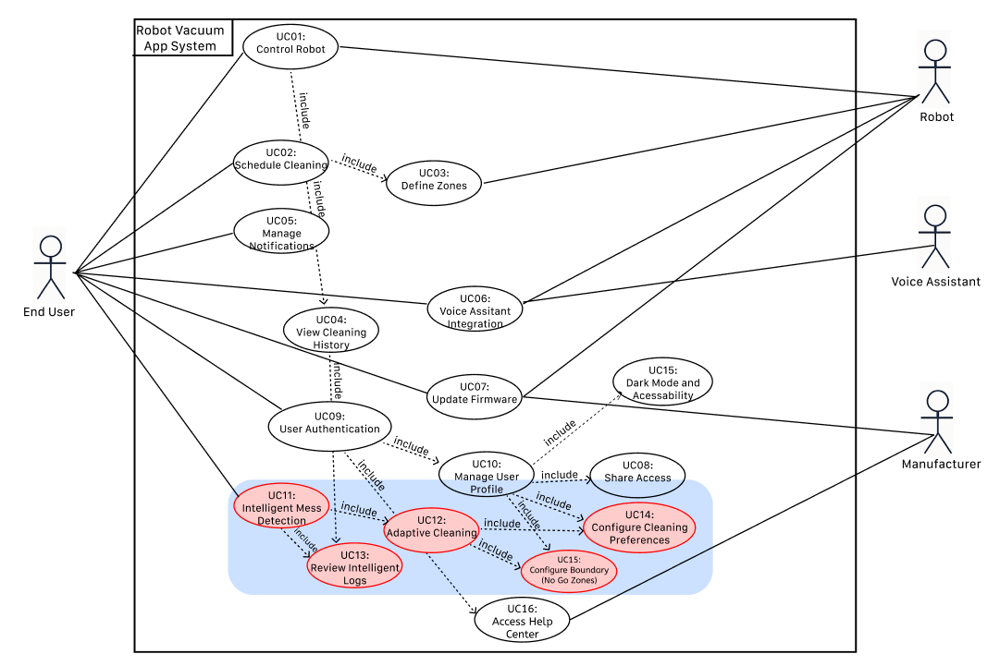
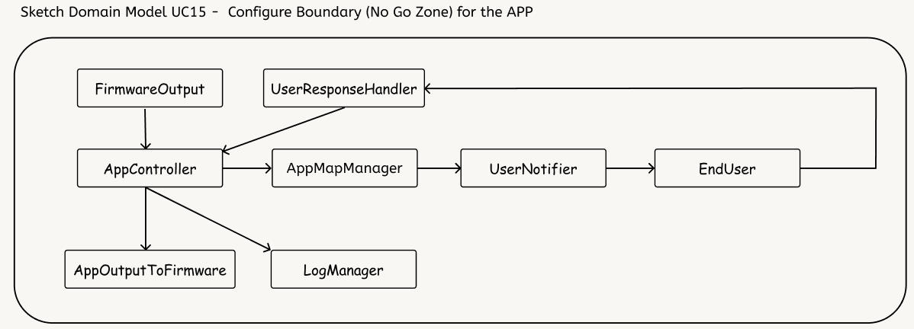
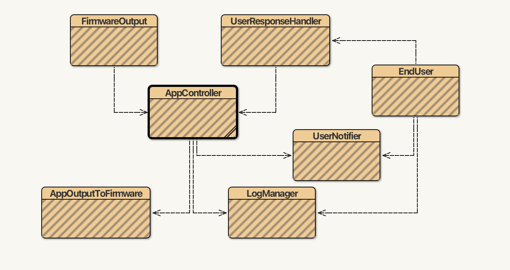
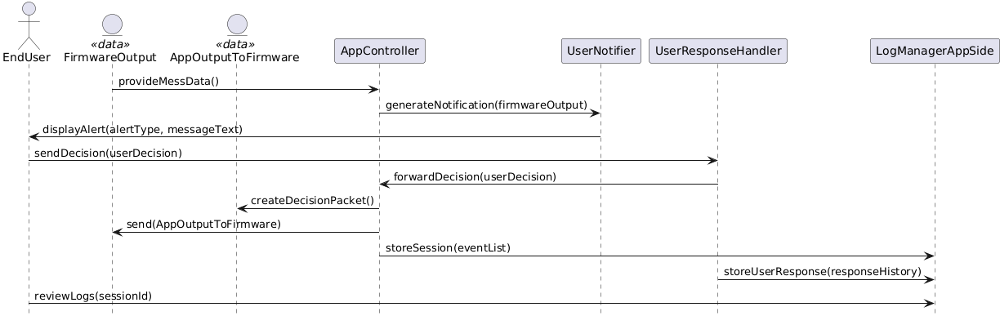
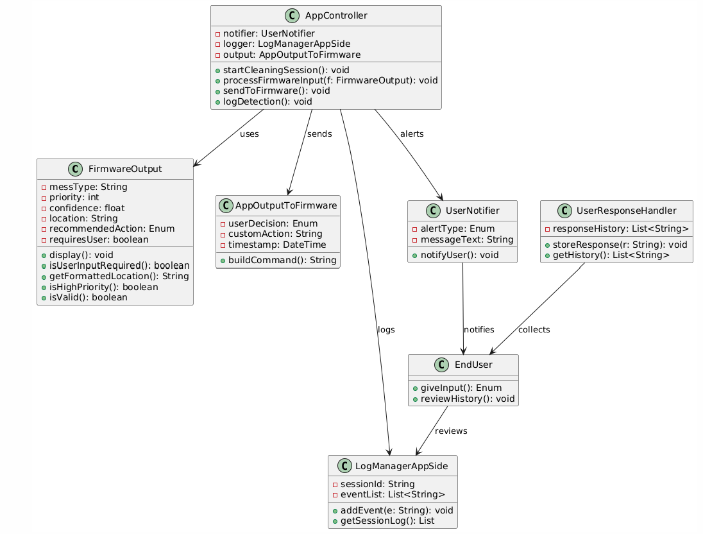

# Software Engineering (SE) Lab 3 Report on Detailed Design of App UC cluster

### Authors

| Family name | First name(s) | Student ID | *Partner A or B* |  
| --- | --- | --- | --- |
| Okabayashi | Larissa | 2827931 | Partner A (Robot App)|  
| Um | Cindy | 2826963 | Partner A (Robot App)|

### Version 
Prep

**Deadlines for this document**

- lab 3 preparation: Monday, May 12, earlier PREP appreciated
- lab 3 final version: Monday, May 19, earlier FINAL appreciated

***Prerequisites:***

| What you check/do now | Why and for what pupose |
 | --- | --- |
| Domain modelling slide set accessed | *lecture 4b contains Slides on Ivan Marsic's domain analysis, tracabilityy matrix (2) etc.*| 
| UC slide set accessed | *UC clusters to be identified"  |
| git pulled | get last version of your partners work
| report 3 pushed | this document renamed and pushed by one of the partners |

**"SE-lab3-Report_*team-Number_AorB_names-of-the-two*"**, upload it (first time by one partner) to gitlab or pull it (later) and commit changes continuously! 

***Tasks***:
- Fulfill Prerequisites (above) **FIRST**!
- New team of partners A OR B provides an original report without plagiarism, see Appendix B and regulations on lab 1 task sheet!
- Transfer suitable content from lab 2: New team members compare their lab 2 final reports on App OR Firmware, identify problems, improve them and decide for a common basis for this lab, i.e. take lab 2 work, refine it and paste it in section 1 of this document.

## Glossary

*This glossary only contains terms related to the application domain. A glossary of SE-related terms is placed into appendix A*

| Term | Acronym | Description |  
| --- | --- | --- |
| Robot Mower | RM | Robotic Lawn Mower |
| Robot Vacuum | RV | Robotic Vacuum Cleaner |
| ... | ... | ... |

## 1. Base documents

### 1a. UC diagram

*Refined UC diagram with your UC-cluster indicated e.g. by color*

*Shortly describe the way you improve and  decide.*

 

To improve the UC diagram, we refined the connections between user interactions and backend system functions, focusing particularly on the Intelligent Cleaning Cluster (UC-11 to UC-14). These were highlighted in a distinct color to denote their logical grouping. The clustering was decided based on functional similarity (mess detection, adaptive behavior, and reporting) and user workflow continuity. This helps modularize implementation and testing in later phases.

## 1b. Detailed UC Descriptions

*Refined Detailed UC Descriptions of UCs in your UC-cluster*

*Shortly describe the way you improve and  decide.*

We refined the connections between user interactions and backend system functions, focusing particularly on the **Intelligent Cleaning Cluster (UC-11 to UC-15)**. This cluster was defined based on functional similarity—specifically around automated mess handling, adaptive response, identifying no go zone boundries and user cleaning personalization. The clustering also follows a user workflow logic: from configuration, to cleaning execution, to post-action insights. This modular design supports focused implementation, testing, and iterative improvement in later phases.

#### UC-11: Intelligent Mess Detection

- **Related Requirements:** REQ-11, REQ-12  
- **Initiating Actor:** Robot Vacuum  
- **Goal:** Automatically detect, classify, and prioritize complex messes using onboard AI models.  
- **Participating Actors:** End User (via app), Sensors  
- **Preconditions:** Robot is powered on, sensors are operational, and cleaning session is active.  
- **Postconditions:** Mess is classified and logged; robot either cleans it or requests manual intervention.

**Flow of Events:**
1. Robot starts cleaning and activates its sensor suite.
2. AI model analyzes environment and detects mess.
3. Mess is classified (e.g., pet waste, spilled cereal).
4. Priority is assigned.
5. If safe → cleaning strategy is adapted.
6. If unsafe → robot pauses and notifies user.
7. User can respond (acknowledge, avoid, intervene).
8. Detection is logged.

**Extensions:**
- Sensor error → pause, notify.
- Low confidence → avoid and flag.
- Cleaning fails → stop, notify.
- No user response → avoid and resume.

#### UC-12: Adaptive Cleaning Execution

- **Related Requirements:** REQ-13, REQ-15  
- **Initiating Actor:** Robot Vacuum  
- **Goal:** Execute optimal cleaning strategies in real-time based on mess type, location, and user preferences.  
- **Participating Actors:** Sensors, UserProfile  
- **Preconditions:** Mess has been detected and classified.  
- **Postconditions:** Robot performs adapted cleaning action and updates log.

**Flow of Events:**
1. Robot receives mess type and severity from UC-11.
2. Fetches appropriate cleaning strategy.
3. Adjusts behavior (e.g., more suction, slower movement).
4. Monitors effectiveness during execution.
5. Logs outcome and flags any issues.

**Extensions:**
- Strategy fails → fallback or notify user.
- No suitable strategy found → skip and log.

#### UC-13: Review Intelligent Cleaning Logs

- **Related Requirements:** REQ-16  
- **Initiating Actor:** End User  
- **Goal:** Allow the user to inspect logs for cleaning sessions, focusing on mess handling and strategy effectiveness.  
- **Participating Actors:** App, Robot  
- **Preconditions:** At least one cleaning session with mess detection has occurred.  
- **Postconditions:** User has viewed or exported session insights.

**Flow of Events:**
1. User opens app and navigates to cleaning history.
2. Selects a session.
3. Views mess types, time stamps, cleaning decisions.
4. Optionally exports report or deletes log.

**Extensions:**
- Logs unavailable → show error.
- User filters by room, time, or mess type.

#### UC-14: Configure Cleaning Preferences

- **Related Requirements:** REQ-10  
- **Initiating Actor:** End User  
- **Goal:** Enable customization of room-specific cleaning behavior and mess response policies.  
- **Participating Actors:** App, UserProfile  
- **Preconditions:** Robot is paired with a user.  
- **Postconditions:** Preferences are saved and synchronized with the robot.

**Flow of Events:**
1. User opens cleaning preferences screen.
2. Selects room or zone.
3. Sets options (e.g., suction power, avoidance, mopping).
4. Saves configuration.
5. Preferences are synced with the robot.

**Extensions:**
- Sync fails → notify user.
- Invalid input → show warning.

#### UC-15: Configure Boundary (No Go Zones)
- **Related Requirements:** REQ-10, REQ-12  
- **Initiating Actor:** End User  
- **Goal:** Allow users to add, modify, and remove virtual boundaries (“no-go” zones) on a map of their home via a mobile app to prevent the robot from entering specific areas.  
- **Participating Actors:** App, UserProfile  
- **Preconditions:** Robot is paired with a user.  
- **Postconditions:** Boundaries are saved and synchronized with the robot.

**Flow of Events:**
1. User opens the mobile app and navigates to the map interface.
2. User draws a virtual boundary or "no-go" zone by marking areas on the map.
3. App saves the boundary definition and syncs it to the robot.
4. Robot updates its navigation map to include the virtual boundary constraints and starts cleaning session.
5. When approaching a defined boundary, the robot re-routes to avoid the restricted area.
6. Robot completes cleaning while respecting all active virtual boundaries.
7. Once cleaning has been completed user receives mobile app notification.

**Extensions:**
- Sync fails → notify user.
- Invalid input → show warning.
- User defines an overlapping or invalid boundary → App notifies user and requests correction.
- Robot is unable to re-route due to narrow paths or fully blocked access → Robot stops, sends alert to user, and logs issue.
- User deletes all boundaries → Robot reverts to standard navigation mode.

## 1c. Activity Diagrams

*Copy your lab 2 Activity Diagrams here*

*Shortly describe if you still consider all or parts of them relevant for this labs work.*

We reused the activity diagrams created in Lab 2 for UC-11. They are still valid because they reflect the detailed flow of AI-based detection and cleaning behavior, which remain at the core of our system. 

##### Activity Diagram for UC-11: Intelligent Mess Detection

## 2. First sketch and list of concepts for your domain model – App-Side Only

*In the sketch, draw associations*

*in the list, give base responsibility of concept, i.e. prototypic class*

*Identify questions to be discussed* 

#### 2.1 Sketch for (Domain Model – Draft) for UC-11: Intelligent Mess Detection – App-Side Only

#### 2.1.2 Sketch for (Domain Model – Draft) for UC-15: Configure Boundary (No Go Zones) – App-Side Only

#### 2.2 Concept List and Base Responsibilities (Prototypic Class) for UC-11: Intelligent Mess Detection – App-Side Only

| **Concept**             | **Type**      | **Responsibility Description**                                                                 |
|-------------------------|---------------|------------------------------------------------------------------------------------------------|
| `AppController`         | Doing (D)     | Receives data from the firmware, displays info to user, and sends commands back if needed     |
| `UserNotifier`          | Doing (D)     | Generates and dispatches app notifications based on incoming firmware data                    |
| `UserResponseHandler`   | Doing (D)     | Interprets user responses (e.g., ignore, avoid area, manual inspection) and updates system     |
| `LogManagerAppSide`     | Doing (D)     | Stores historical session logs and mess classifications locally on the app                    |
| `EndUser`               | Actor (A)     | Interacts with the app: receives alerts, sends decisions, and reviews logs                    |
| `AppOutputToFirmware`   | Data (K)      | Encapsulates structured commands/decisions to be sent from the app to the firmware            |
| `FirmwareOutput`        | Data (K)      | Contains structured data received from the firmware (mess type, confidence, etc.)             |

#### 2.2.2 Concept List and Base Responsibilities (Prototypic Class) for UC-15: Configure Boundary (No Go Zones) – App-Side Only

| **Concept**             | **Type**      | **Responsibility Description**                                                                 |
|-------------------------|---------------|------------------------------------------------------------------------------------------------|
| `AppController`         | Doing (D)     | Receives data (map) from the firmware, displays info to user, and sends commands back if needed|
| `AppMapManager`         | Doing (D)     | Generates and displays app map based on incoming firmware data                                 |  
| `UserNotifier`          | Doing (D)     | Generates and dispatches app notifications based on incoming firmware data                     |
| `UserResponseHandler`   | Doing (D)     | Interprets user responses (e.g., CRUD: add, edit, update and delete map) and updates system    |
| `LogManagerAppSide`     | Doing (D)     | Stores historical session logs and no go zones locally on the app                              |
| `EndUser`               | Actor (A)     | Interacts with the app: receives alerts, sends decisions, and reviews logs                     |
| `AppOutputToFirmware`   | Data (K)      | Encapsulates structured commands/decisions to be sent from the app to the firmware             |
| `FirmwareOutput`        | Data (K)      | Contains structured data received from the firmware (map, user preferences, etc)               |
  

## 3. Refined tables of Responsibility, Associations and Properties for UC-11: Intelligent Mess Detection – App-Side Only

*As described in the lab taks sheet, I can recommend to use BlueJ for refining your paperwork of section 2 and finally extract all information for the tables from class javadoc and fields.*

#### 3.1 Extracting Associations for UC-11: Intelligent Mess Detection

| **Association**               | **Description**                                                                      | **Class Pair**                             |
|-------------------------------|--------------------------------------------------------------------------------------|--------------------------------------------|
| processes firmware input      | `AppController` receives and processes a `FirmwareOutput` object                    | `AppController` ↔ `FirmwareOutput`         |
| notifies user                 | `UserNotifier` generates alerts for the `EndUser`                                   | `UserNotifier` ↔ `EndUser`                 |
| collects user decisions       | `UserResponseHandler` collects input from the `EndUser`                             | `UserResponseHandler` ↔ `EndUser`          |
| sends to firmware             | `AppController` constructs and sends `AppOutputToFirmware` back to the firmware     | `AppController` ↔ `AppOutputToFirmware`    |
| stores in log                 | `AppController` or `UserResponseHandler` sends session data to `LogManagerAppSide`  | `AppController` ↔ `LogManagerAppSide`      |
| accesses history              | `EndUser` reviews previous sessions via `LogManagerAppSide`                         | `EndUser` ↔ `LogManagerAppSide`            |

#### 3.2 Extracting Attributes for UC-11: Intelligent Mess Detection

| **Concept**             | **Attribute**              | **Description**                                                           |
|-------------------------|----------------------------|---------------------------------------------------------------------------|
| `FirmwareOutput`        | `messType` (String)        | Type of mess detected (e.g., pet waste, spill)                            |
|                         | `priority` (int)           | Mess severity or urgency level                                            |
|                         | `confidence` (float)       | Confidence in classification result                                       |
|                         | `location` (String)        | Coordinates or label of where the mess was found                          |
|                         | `recommendedAction` (Enum) | Suggested robot response: CLEAN, AVOID, ALERT_USER                        |
|                         | `requiresUser` (boolean)   | Whether user input is required                                            |
| `AppOutputToFirmware`   | `userDecision` (Enum)      | The decision selected by the user: ACKNOWLEDGE, IGNORE, AVOID             |
|                         | `customAction` (String)    | Optional override command                                                 |
|                         | `timestamp` (DateTime)     | When the decision was sent                                                |
| `LogManagerAppSide`     | `sessionId` (String)       | Unique ID for the cleaning session                                        |
|                         | `eventList` (List)         | List of messages, messes, or decisions made during the session            |
| `UserNotifier`          | `alertType` (Enum)         | Type of alert: INFO, WARNING, CRITICAL                                    |
|                         | `messageText` (String)     | Text message shown to the user                                            |
| `UserResponseHandler`   | `responseHistory` (List)   | Stores past decisions made by the user                                    |

##### Notes

- `FirmwareOutput` and `AppOutputToFirmware` act as structured **DTOs** (Data Transfer Objects) that facilitate communication between firmware and app.
- `EndUser` is passive but central, influencing system flow via decision-making.
- The separation of `UserNotifier` and `UserResponseHandler` ensures a clean command-query responsibility split (CQRS) on the app side.

## 4. Domain model diagram for UC-11: Intelligent Mess Detection – App-Side Only

*Prototypic class diagram with associations and properies.*

*Best edit your class diagram in BlueJ (best make arrows point right down), then take a screenshot and annotate associations to the arrows*

*Alternatively draw it by Visual Paradigm or other tool*

#### Domain Model Implementation in BlueJ

You can explore the complete domain model for UC-11 (Intelligent Mess Detection) implemented in Java using BlueJ here:

[Download UC11_IntelligentMessDetection.zip](UC11_IntelligentMessDetection-App.zip)

The class diagram for UC-11 implemented in BlueJ is shown below:

## 5. Tracability Matrix (2)

*Relates concepts to UCs*
| **Use Case** | RobotController | SensorArray | MessClassifier | Mess | PriorityAssigner | CleaningStrategyEngine | UserNotifier | UserResponseHandler | LogManager | Scheduler | MapEditor | VoiceAssistantAPI | NotificationManager | FirmwareUpdater | AuthService | UserProfileManager | HelpCenterModule |
| ------------ | --------------- | ----------- | -------------- | ---- | ---------------- | ---------------------- | ------------ | ------------------- | ---------- | --------- | --------- | ----------------- | ------------------- | --------------- | ----------- | ------------------ | ---------------- |
| **UC-1**     | X               |             |                |      |                  | X                      |              |                     |            |           |           |                   |                     |                 |             |                    |                  |
| **UC-2**     |                 |             |                |      |                  | X                      |              |                     | X          | X         |           |                   |                     |                 |             |                    |                  |
| **UC-3**     |                 |             |                |      |                  |                        |              |                     |            |           | X         |                   |                     |                 |             |                    |                  |
| **UC-4**     | X               |             |                | X    |                  |                        |              |                     | X          |           |           |                   |                     |                 |             |                    |                  |
| **UC-5**     |                 |             |                |      |                  |                        | X            |                     |            |           |           |                   | X                   |                 |             |                    |                  |
| **UC-6**     | X               |             |                |      |                  |                        |              |                     |            |           |           | X                 |                     |                 |             |                    |                  |
| **UC-7**     |                 |             |                |      |                  |                        |              |                     |            |           |           |                   |                     | X               |             |                    |                  |
| **UC-8**     |                 |             |                |      |                  |                        |              |                     |            |           |           |                   |                     |                 |             | X                  |                  |
| **UC-9**     |                 |             |                |      |                  |                        |              |                     |            |           |           |                   |                     |                 | X           |                    |                  |
| **UC-10**    |                 |             |                |      |                  |                        |              |                     |            |           |           |                   |                     |                 |             | X                  |                  |
| **UC-11**    | X               | X           | X              | X    | X                | X                      | X            | X                   | X          |           |           |                   |                     |                 |             |                    |                  |
| **UC-12**    | X               | X           | X              | X    | X                | X                      |              |                     | X          |           |           |                   |                     |                 |             |                    |                  |
| **UC-13**    |                 |             |                | X    |                  |                        |              |                     | X          |           |           |                   |                     |                 |             |                    |                  |
| **UC-14**    |                 |             |                |      |                  | X                      |              |                     |            |           | X         |                   |                     |                 |             |                    |                  |
| **UC-15**    |                 |             |                |      |                  |                        |              |                     |            |           |           |                   |                     |                 |             | X                  |                  |
| **UC-16**    |                 |             |                |      |                  |                        |              |                     |            |           |           |                   |                     |                 |             |                    | X                |

## 6. Sketch of a sequence diegram

*Indicate dynamic behavior by event walk-through that indicates what your UC-demonstrator will do when events are generated by initiating actors*

The following sequence diagram illustrates the dynamic behavior of the **UC-11: Intelligent Mess Detection – App-Side Only** system. It describes how the app components interact in response to mess detection events initiated by the firmware and decisions made by the end user.

The scenario modeled below corresponds to a situation where the firmware detects a mess that requires user input, such as choosing whether to acknowledge, ignore, or avoid the area.

#### Event Walk-Through:

1. The system starts when the `FirmwareOutput` component sends structured mess data to the `AppController`. This includes details like the mess type, priority, and confidence score.

2. The `AppController` processes the input and delegates the task of notifying the user to the `UserNotifier`.

3. `UserNotifier` creates an alert message based on the data and dispatches it to the `EndUser`.

4. The `EndUser` receives the alert and submits a decision (e.g., "Avoid the area") via the `UserResponseHandler`.

5. `UserResponseHandler` interprets the user’s response and forwards it to the `AppController`.

6. The `AppController` then constructs a command message in an `AppOutputToFirmware` object and sends it back to the firmware.

7. The system logs the mess and decision by interacting with the `LogManagerAppSide`, ensuring traceability of both session data and user responses.

8. Optionally, the `EndUser` can later access the `LogManagerAppSide` to review historical logs from previous sessions.

This sequence captures the core responsibilities of each component and demonstrates a clean separation of concerns using the command-query responsibility segregation (CQRS) principle.

#### UML Sequence Diagram

## 7. Class diagram with Methods

*Annotate methods to your class dagram*

### References

## Appendix A (SE Glossary)

| Term | Acronym | Description |  
| --- | --- | --- |
| Concept | - | Prototypic class in domain model without methods |
| Boundary Concept | - | receives or sends events from or to external actors |
| Knowing Concepts | - | Data classes |
| Association | - | to be done ... |
| Domain Model | DM | Based on Responsibilities, concepts are defined (boundary or internal) with associations and properies |

## Appendix B (AI support)

*If you used AI tools, give a Keyword and section of this document, then a list of your inputs to the AI prompt*

AI Tool: ChatGPT
Sections: 2
Prompts: “Help me write concept table for robot app design”