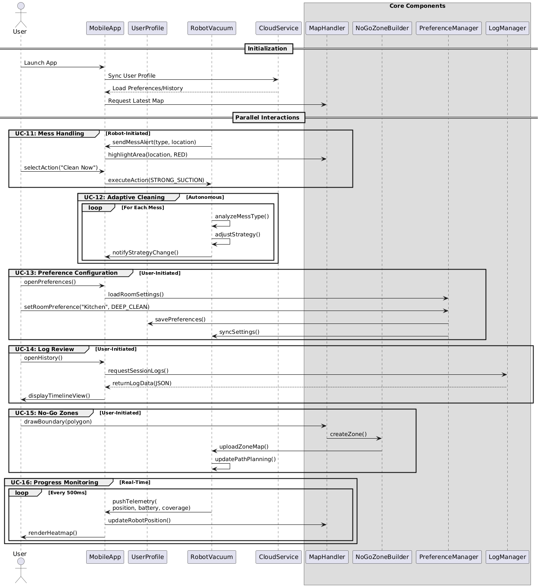

# Software Engineering (SE) Lab 4 Report on UC-demonstrator program

### Authors

| Family name | First name(s) | Student ID | *Partner A or B* |  
| --- | --- | --- | --- |
| Okabayashi | Larissa | 2827931 | Partner A (Robot App)|  
| Um | Cindy | 2826963 | Partner A (Robot App)|


### Version 
Final

## Glossary

*This glossary only contains terms related to the application domain. A glossary of SE-related terms is placed into appendix A*

| Term | Acronym | Description |  
| --- | --- | --- |
| Robot Mower | RM | Robotic Lawn Mower |
| Robot Vacuum | RV | Robotic Vacuum Cleaner |
| ... | ... | ... |

## 1. Base documents Updated (Partner Larissa)

Following the professor's review of our previous submission, several shortcomings were identified:

The design abstraction for the app was too high-level and lacked concrete demonstrator behavior.

MVC architectural principles had not been properly applied.

Our firmware and App applications were focusing on different use cases

To address these, we redefined our architecture around a focused use case, integrated MVC principles, and simplified the demonstrator logic for clarity and technical feasibility.

*The image below illustrates the revised use case cluster: (Larissa)**


## BluJ UC Cluster Demonstrator (Cindy)

[App Implementing Design Patterns](./App%20Implementing%20Design%20Patterns/)


## Use Case Cluster Adjustment (UC-11 to UC-16)

### Overview

To address the feedback provided, we have revised and expanded the use case cluster to include all relevant functionalities between UC-11 and UC-16. Additionally, UC-11 has been renamed from *Intelligent Mess Detection* to **DisplayAndControlMessDetected** based on feedback from `Feedback/lab3-feedback.md`.

## Discover UC Clusters (Cindy) (redo lab 3)
After reviewing our earlier submission, we recognized that the previously defined Responsibility Descriptions lacked sufficient depth and alignment with the system's intended behavior. As a corrective measure, we revisited the responsibility design process from the ground up.

Actions Taken: Revisited Design Principles
I systematically applied established responsibility-driven design principles, including the Expert Doer, High Cohesion, and Low Coupling principles, to guide our decisions.

**Step 1: Extract Responsibilities**

I began by carefully analyzing the Use Case descriptions and domain context to identify core responsibilities. For each identified responsibility I clarified the nature (doing/knowing).


**Step 2: Extract Associations**

To ensure the system concepts could work together meaningfully, I identified associations between them based on how responsibilities were delegated. I followed the "who works with whom" principle, focusing on clear communication between boundary, control, and entity classes.


**Step 3: Construct Domain Model for Cluster UC11 - UC16**

Using the responsibilities and associations, I mapped each domain concept into a structural domain model.


**Step 4: Map Use Cases to Domain Model with Traceability Matrix (2)**

Following Lecture 4b slide set we first started by checking UC Clustering in the traceability matrix to see how the UC's are interrelated


**Step 5: Sequence Diagram: Version 1**

The following sequence diagram represents Version 1 of the dynamic interaction model for Use Cases UC-11 to UC-16. It was developed based on the extracted responsibilities and associations and adheres strictly to Professor Renz’s modeling principles outlined in Lecture 5a. Sequence Diagrams.

Each use case is treated in a distinct interaction block, illustrating the message flow between the relevant domain concepts. At this stage, the design emphasizes structural clarity and correctness over completeness, serving as a foundational version to be refined in future iterations as method signatures, control structures (e.g., loops, alternatives), and message parameters become more detailed.


The sequence diagram demonstrates a centralized control structure, where core controller components (e.g. CleaningController, PreferenceManager, LogManager) coordinate the interactions between boundary and entity classes. Each use case is directed through a primary controller that encapsulates the main logic and delegates tasks to other components. 

Given that I am planning to implement the user interface, the next step will be to extend this and implement **Design Patterns** such as **MVC**. 

**Step 6: Simple Validated Class Diagram**

The current class diagram represents the “first-cut” structural model of the cleaning-robot subsystem. In line with Prof. Renz’s Lecture 4a guidance, it captures only the static essentials—classes, attributes/operations with full visibility, realistic multiplicities and the ECB (Entity-Control-Boundary) layering—but no design patterns yet. This minimal baseline complies with the lecture’s rule that “class diagrams model structure first; behaviour and variability come later”

Keeping the diagram pattern-free at this stage serves two purposes. First, it lets us validate the static relationships against upcoming sequence-diagram scenarios without the extra indirection that patterns introduce.


## Lab 4: Design Pattern Implementation (Cindy)

Now that I have a working idea of my application domain I will construct a first version of my class diagram following the class design principles outlined in Lecture 5b. 

### Implement MVC Design Pattern
The transition from ECB (Entity-Control-Boundary) to MVC (Model-View-Controller) pattern was strategically chosen to optimize the user interface architecture of my robot app system.

 While ECB effectively separates system concerns at a high level, MVC provides superior benefits for UI-centric applications through its implementation of the Observer and Strategy patterns. The Observer pattern enables automatic view updates when model state changes, eliminating the need for manual synchronization between data and display components—critical for real-time cleaning progress updates and preference changes. 
 
 Additionally, MVC's Strategy pattern allows views to delegate user interaction handling to controllers, creating a more flexible and maintainable architecture where UI behavior can be modified independently of display logic. This separation becomes particularly valuable in my system where multiple views (status displays, preference panels, boundary editors) must present the same underlying data differently while responding to user inputs consistently. The compound nature of MVC also supports nested view hierarchies and multiple simultaneous views of the same data, enabling features like concurrent status monitoring and preference editing that would be more complex to implement with ECB's simpler boundary-control relationship.


### Implement Observer Design Pattern

Following the lecture notes on compound-pattern stack, MVC already assumes Observer between Model ↔ View so that views update themselves whenever the model’s state changes. So I then went ahead and implemented this across my code. 

**CleaningSession** acts as the concrete subject, tracking progress as a float value and maintaining a list of registered observers. When progress updates via setProgress(), it automatically notifies all observers.
Observer Components handle different display aspects:
- CleaningStatusView: Updates the main UI progress display
- NotificationManager: Triggers system notifications based on progress changes


**Room-preference**

RoomPreferenceStorage is now a Subject. After setPreference(roomId, pref) mutates the map, it fires notifyObservers(). Every PreferenceView registers once and receives update letting users see their changes propagate in real time—no “refresh” button, no extra controller glue.


**Live no-go-zone overlay**

BoundaryStorage became a Subject; both addZone(Polygon) and removeZone(Polygon) invoke notifyObservers().

MapHandler registers as an Observer and gets the fresh zone list in update(zones), then re-renders the overlay on the floor map. The validation logic stays in BoundaryValidator, rendering stays in MapHandler; Observer keeps them loosely coupled.


**Real-time session-log feed**

SessionLog now serves as the Subject. When addEntry(SessionEntry) appends to the list, it triggers notifyObservers().

Each open LogViewer (an Observer) receives update(newEntry) and appends the row to its on-screen table. You can open or close viewers at runtime without touching logging code—classic one-to-many flexibility.


**Class Diagram with Implemented Observer Design Pattern**


### Strategy Design Pattern (Cindy + Larissa)

To decouple what we clean from how we clean, we inserted the Strategy pattern: CleaningController chooses a CleaningAction (e.g., Standard, Spot) and stores it in CleaningSession. The controller now delegates the algorithm instead of branching over modes, so new cleaning styles can be plugged in without touching existing code, and behaviour can even change at runtime. This keeps the system open for extension, testable in isolation, “identify-and-encapsulate variation”.


Here is what the new class diagram looks like for the entire app program now with both the strategy and observer design patterns implemented


### Singleton Design Pattern (Cindy + Larissa)

To ensure that all system components log to a single shared source, the **SessionLog** class was refactored to implement the Singleton pattern. This guarantees exactly one log instance throughout the application’s lifecycle. A static getInstance() method handles lazy initialization with thread safety. The Logger controller was updated to use this global access point instead of direct instantiation.


### Final Class Diagram Implementing 3 Design Patterns (Cindy + Larissa)
In this final class model, three well-established object-oriented design patterns have been integrated to enhance flexibility, maintainability, and clarity of system responsibilities:

- **Observer Pattern:** Applied to decouple the dynamic system state (e.g., cleaning progress) from its multiple UI representations and notification components. The CleaningSession acts as the subject, notifying views such as CleaningStatusView, NotificationManager, and LogViewer.

- **Strategy Pattern:** Incorporated in the CleaningSession to enable interchangeable cleaning behaviors (e.g., adaptive modes based on mess type). This supports runtime flexibility and variation of algorithms, consistent with the Strategy principle of encapsulating what varies.

- **Singleton Pattern:** Employed for the SessionLog, ensuring that all interactions and system events are consistently recorded through a single globally accessible instance. This follows the Renz lecture guideline that log and config managers should not be duplicated across components.


This class diagram is the result of systematically refining the domain model and sequence interactions, ensuring full traceability back to Use Cases UC-11 to UC-16. Each pattern has been deliberately chosen based on the evolving system needs and adheres to the design principles discussed throughout the course: low coupling, high cohesion, and programming to interfaces rather than implementations.

### Final Sequence Diagram Implementing 3 Design Patterns (Cindy + Larissa)

The following UML sequence diagram models the dynamic behavior across the full UC-11 to UC-16 cluster. It refines the domain model into a behavioral perspective and explicitly demonstrates the integration of design patterns such as Observer, Strategy, and Singleton into the system’s interaction design.

The control style here is mostly distributed, consistent with object-oriented design principles. CleaningSession becomes a central collaboration point, embodying both behavioral encapsulation and event propagation (Observer). Strategy selection and progress updates happen inside domain objects, minimizing centralized orchestration and enhancing modifiability.


## Detailed Use Cases (Larissa)

### UC-11: DisplayAndControlMess
**Related Requirements:** REQ-11, REQ-12, REQ-19  
**Initiating Actor:** Robot Vacuum  
**Goal:** Visually alert the user when a mess is detected and allow manual user response via the app.

**Flow of Events:**
1. The robot detects a mess and sends an event to the system.  
2. `CleaningController` relays the mess event to `MapHandler` to visually highlight the affected region.  
3. Simultaneously, `CleaningController` notifies `NotificationManager` to display an alert to the user.  
4. The user responds via the app UI; input is interpreted and routed by `CleaningController` to trigger the selected action (e.g., clean now, ignore, schedule).

**Extensions:**
- If no user action is taken, `CleaningController` logs the event via `Logger`.  
- If notification delivery fails, a retry attempt is triggered; failure is also logged.

---

### UC-12: AdaptiveCleaning  
**Goal:** Automatically adapt the cleaning strategy based on mess type.

**Flow of Events:**
1. Robot classifies the mess (e.g., dust, spill) and sends this information to `CleaningController`.  
2. `CleaningController` applies the appropriate strategy using its internal logic or a delegated component.  
3. `MapHandler` is updated to reflect any changes in cleaning behavior visually.  
4. `CleaningStatusView` is refreshed to show the new strategy or state, and `NotificationManager` sends an info notification if enabled.  
5. Results are forwarded to `Logger` for persistent storage.

---

### UC-13: ConfigureCleaningPreferences  
**Related Requirements:** REQ-10  
**Initiating Actor:** End User  
**Participating Actors:** Mobile App, User Profile  
**Goal:** Allow users to customize cleaning behavior by room.

**Preconditions:** User is authenticated and paired with a robot.  
**Postconditions:** Preferences are stored in `RoomPreferenceStorage` and synchronized.

**Flow of Events:**
1. User opens the `PreferenceView` UI and selects a room or zone.  
2. Edits are passed to `PreferenceManager`, which validates and applies changes.  
3. Updated preferences are saved to `RoomPreferenceStorage`.  
4. `CleaningController` is notified and may adjust strategy accordingly.

**Extensions:**
- If validation fails (e.g., invalid value), a warning is shown.  
- If syncing with robot fails, user is notified and retry is queued.

---

### UC-14: ReviewLogs  
**Goal:** Let users review past cleaning activity for transparency and analysis.

**Flow of Events:**
1. User opens the `LogViewer` interface.  
2. `LogViewer` requests session logs from `SessionLog`.  
3. Entries are formatted and displayed, including mess events, actions taken, and strategies used.  
4. Filter and search options may be provided.

---

### UC-15: ConfigureBoundary (No-Go Zones)  
**Related Requirements:** REQ-10, REQ-12  
**Initiating Actor:** End User  
**Participating Actors:** Mobile App  
**Goal:** Enable users to define and manage no-go zones on the map.

**Preconditions:** Valid environment map exists and robot is paired.  
**Postconditions:** Zones are stored and active in the robot’s path planning.

**Flow of Events:**
1. User opens map in app and draws a no-go zone via `BoundaryEditor`.  
2. The zone is sent to `BoundaryValidator` to ensure it doesn’t conflict with existing zones.  
3. If valid, the zone is saved to `BoundaryStorage`.  
4. `MapHandler` overlays the zone visually on the map.  
5. During cleaning, robot avoids these zones dynamically.

**Extensions:**
- If zone definition is invalid, error is displayed.  
- If syncing with robot fails, zone is cached for retry.

---

### UC-16: DisplayCleaningProgress  
**Related Requirements:** REQ-13, REQ-21  
**Goal:** Provide real-time visual and numeric feedback on cleaning progress.

**Flow of Events:**
1. Robot streams telemetry and progress data to `CleaningController`.  
2. `CleaningController` forwards the data to `CleaningStatusView`.  
3. UI is updated to show percent cleaned and coverage map via `MapHandler`.  
4. If the session ends, `NotificationManager` informs the user and `Logger` stores session summary.

**Extensions:**
- If robot is paused, status updates reflect idle state.  
- If data transmission fails, fallback messaging or retry is triggered.


## Integration of Professors' Feedback as of 5/06/2025

Several modifications were made to address review feedback and ensure consistency with the software architecture:

- **Basic Map Initialization**: The component `MapHandler` now explicitly provides the coordinate system and base map structure.
- **No-Go Zone Handling**:
  - `NoGoZoneBuilder` is responsible for instantiating the polygon on event `onZoneDrawn()`.
  - `MapHandler` captures the finalized user input.
  - Observers of finalized zone updates now include `MapView`, `NotificationView`, and `AppToFirmwareSender`.
- **Continuous Robot Feedback**:
  - A loop was added to simulate telemetry push from the robot every 500ms.
  - Real-time updates include position, battery, and coverage, propagated to `MapHandler` and rendered live for the user.
- **Design Pattern Representation**:
  - **Observer**: Map and robot state updates to UI components.
  - **Command**: Encapsulation of user actions like "Clean Now".
  - **Strategy**: Adaptive cleaning logic based on mess type.
  - **MVC**: Separation between data models, views, and controller logic across components.

These changes ensure that the diagram reflects both user-facing functionality and the internal architectural flow, adhering to the system’s dynamic behavior and design standards.




### 1.3 Class Diagram with Methods (Partner Larissa)

The UML class diagram below represents the structural design of the core components involved in UC-15 (Configure Boundary / No-Go Zones), including their methods and interactions based on the Model–View–Controller (MVC) pattern. This diagram includes both app-side and firmware communication classes.

 

#### Class Responsibilities and Methods

- **`NoGoZoneController` (Controller)**
  - `onZoneDrawn(int x1, int y1, int x2, int y2, String label)`
  - `onCleaningComplete(FirmwareOutput output, NotificationView view)`
  - Role: Entry point for user interactions and firmware status updates. Translates events into model updates and view feedback.

- **`NoGoZoneModel` (Model)**
  - `addZone(NoGoZone zone)`
  - `removeZone(NoGoZone zone)`
  - `addObserver(ModelObserver obs)`
  - `notifyObservers()`
  - Role: Maintains the list of no-go zones and notifies registered views upon any update.

- **`MapInteractionHandler` (Interaction Layer)**
  - `handleUserDraw(int x1, int y1, int x2, int y2, String label)`
  - Role: Delegates user-drawn zone data to the controller; acts as an intermediary between UI drawing components and business logic.

- **`MapView` (View)**
  - `modelUpdated(List<NoGoZone> zones)`
  - `sendUpdatedMapToFirmware()`
  - Role: Visual representation of the environment. Redraws map overlays and pushes the updated map to firmware.

- **`NotificationView` (View)**
  - `showCompletion()`
  - Role: Notifies the user when cleaning is finished.

- **`NoGoZone` (Entity)**
  - Fields: `xStart`, `yStart`, `xEnd`, `yEnd`, `label`
  - Role: Data structure for representing a restricted rectangular area.

- **`FirmwareOutput` (Entity from firmware)**
  - Fields: `int[][] mapGrid`, `boolean cleaningComplete`
  - Methods: `getMapGrid()`
  - Role: Encapsulates firmware-side environment updates and cleaning status signals.

- **`RobotFirmwareReceiver` (Boundary)**
  - `receiveUpdatedMap(int[][] map)`
  - Role: Simulated firmware endpoint that receives map data containing no-go zones from the app.

## 2. Architectural Design (Partner Larissa) 

#### 2.1 MVC Component Mapping  
| **Component**             | **Role**       | **Key Responsibilities**                          |  
|---------------------------|----------------|---------------------------------------------------|  
| `NoGoZoneModel`           | Model          | Stores zone data; notifies views of changes.      |  
| `MapInteractionHandler`   | Interaction    | Receives UI input and delegates to controller.     |
| `MapView`                 | Observer/View           | Renders interactive map and zones.                |  
| `NoGoZoneController`      | Controller     | Handles user drawing actions; updates model.      |  
| `AppToFirmwareSender`     | Service        | Sends zone data to robot firmware.                |  
| `RobotFirmwareReceiver`   | External Actor | Receives map updates from the app.                |  
| `FirmwareOutput`          | External Actor | Sends robot status (e.g., `cleaningComplete`).    |  
| `NotificationView`        | Observer/View  | Displays completion alerts.                       |  

### 2.2 Observer Pattern Implementation (Corrected)

Following design feedback, the Observer Pattern is now implemented with correct registration timing:

- `MapView` and `NotificationView` register as observers **when the user enables map or notification features**.
- `AppToFirmwareSender` is registered **when the robot becomes ready for communication** (e.g., post-boot or sync).
- `NoGoZoneModel` acts as the **Subject**, broadcasting state changes to all registered observers.

This ensures decoupled, real-time propagation of updates, aligning with clean architectural design principles.

### 2.3 Real-Time Telemetry and Robot State Feedback

To support UC-16 (progress monitoring), telemetry data is streamed every 500ms from the robot to the app:

- Handled by `FirmwareOutput`, which sends:
  - `position` (x, y)
  - `mapGrid` (cleaned areas)
  - `status` (e.g., cleaning, idle, returning to base, paused)
- Processed by `MapInteractionHandler` and rendered via `MapView` as an evolving heatmap.
- Timeline status updates are also displayed in `NotificationView`.
  
#### 2.4 Revised Firmware Data Representation  
The `FirmwareOutput` now includes a **2D grid** (`mapGrid`) encoding:  
- `0`: Clean area  
- `1`: Mess (to clean)  
- `2`: No-Go Zone  

**Example**:  
```python
mapGrid = [
    [0, 1, 2],
    [0, 2, 1],
    [2, 0, 0]
] 
```
### 3. BlueJ Implementation of UC-15 Demonstrator (Partner Larissa)

To validate our redesigned MVC architecture and make the system executable, we implemented a functional demonstrator of UC-15 (*Configure Boundary / No Go Zones*) in **BlueJ**. This environment was chosen for its pedagogical focus and visual clarity in illustrating object-oriented structures.

#### 3.1 Project Structure

The BlueJ project is organized around the MVC principles:

- **Model**
  - `NoGoZone`: Represents rectangular no-go areas.
  - `NoGoZoneModel`: Stores and manages a dynamic list of zones and notifies observers.
  
- **View**
  - `MapView`: Renders the map and overlays zones; sends the updated grid to firmware.
  - `NotificationView`: Displays messages upon cleaning completion.
  
- **Controller**
  - `NoGoZoneController`: Handles user input and firmware output; triggers model and view updates.

- **Interaction Layer**
  - `MapInteractionHandler`: Receives user-drawn zone data and forwards it to the controller.

- **Firmware Communication**
  - `FirmwareOutput`: Simulates firmware-side map and cleaning completion status.
  - `RobotFirmwareReceiver`: Simulates the reception of zone updates on the firmware side.

- **Observer Pattern**
  - `ModelObserver`: Interface that enables views to react to changes in the model.

#### 3.2 Example Scenario in Code 

The following sequence demonstrates a simulated end-to-end interaction:

```java
int[][] initialMap = new int[5][5]; // Clean grid
NoGoZoneModel model = new NoGoZoneModel();
AppToFirmwareSender firmware = new AppToFirmwareSender();
MapView mapDisplay = new MapView(firmware, initialMap);
NotificationView notification = new NotificationView();
NoGoZoneController controller = new NoGoZoneController(model);

model.addObserver(mapDisplay);

// Simulate user drawing a no-go zone
controller.onZoneDrawn(1, 1, 2, 2, "Carpet");

// Simulate cleaning completion from firmware
FirmwareOutput result = new FirmwareOutput(initialMap, true);
controller.onCleaningComplete(result, notification);
```

#### 3.3 BlueJ UC Demonstrator Program

 

UC Demonstrator in BlueJ: In the BlueJ_UC15 Folder.

### 4. Design Pattern Usage (Partner Larissa)

To improve modularity, maintainability, and architectural clarity, we incorporated several key design patterns into our UC-15 implementation. These patterns align with the guidelines introduced in SE_06a_Renz_DesignPatterns and help enforce a separation of concerns in our MVC architecture.

#### 4.1 Model–View–Controller (MVC)

The entire demonstrator is structured around the **MVC architectural pattern**, which separates:

- **Model** (`NoGoZoneModel`) — the application's data and business logic
- **View** (`MapView`, `NotificationView`) — the UI representations and user feedback
- **Controller** (`NoGoZoneController`) — user input handling and coordination logic

This pattern facilitates asynchronous interaction, clean dependency flow, and modular testing.

#### 4.2 Observer Pattern (Corrected and Extended)

The application adopts the **Observer pattern** to enable reactive, asynchronous updates across UI components and robot communication interfaces.

- `NoGoZoneModel` serves as the **Subject**, maintaining a list of observers and notifying them on state changes.
- Observers include:
  - `MapView` – updates map visuals when zones or telemetry change.
  - `NotificationView` – displays messages when cleaning tasks complete or states shift.
  - `AppToFirmwareSender` – 
    - continuously and asynchronously transmits real-time robot state (e.g., cleaning progress, position, battery) and finalized zone configurations to the robot firmware once communication is established.
    - ensures the robot’s path planning and cleaning status remain synchronized with the app throughout operation, not just at task completion.

Observers are registered dynamically:
- `MapView` and `NotificationView` register when the user enables relevant UI features.
- `AppToFirmwareSender` is registered only after robot communication is ready.

This implementation ensures loose coupling, scalability for future observers (e.g., logging systems), and compliance with correct observer registration practices.

#### 4.3 Decorator Pattern (Partner Cindy)
To enhance the flexibility and extensibility of the notification system without altering existing logic, we applied the **Decorator Pattern** to the `NotificationView` interface.

- `NotificationView` defines the contract for all completion-based alerts via `showCompletion()`.
- `BasicNotificationView` implements the default notification behavior (e.g., UI-based messages).
- `NotificationDecorator` is an abstract wrapper class that holds a reference to another `NotificationView` and delegates calls to it.
- Concrete decorators such as `SoundNotificationDecorator`, `VibrationNotificationDecorator`, and `BannerNotificationDecorator` extend `NotificationDecorator` to add modular features like sound feedback, device vibration, or log messages upon task completion.

This approach aligns with the **Open/Closed Principle**, allowing us to introduce new types of user feedback without modifying core classes. Decorators can be composed dynamically at runtime, enabling flexible combinations based on device capabilities or user settings. By isolating optional behaviors in decorators, we maintain **single responsibility** within each class and keep the notification pipeline clean, testable, and easy to evolve.