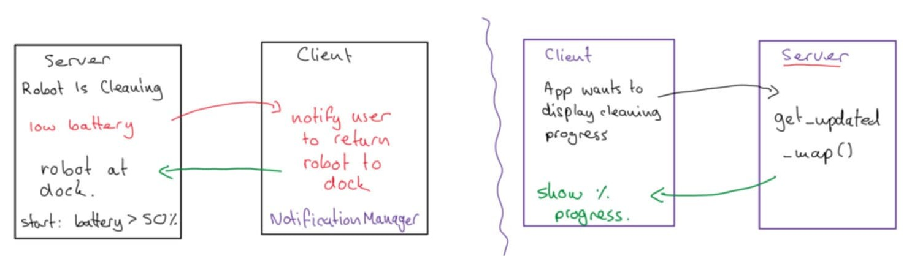

# Software Engineering (SE) Lab 5-6 Report on Distributed UC-cluster Demonstrator of App team OR Firmware team

### Authors

| Family name | First name(s) | Student ID | *Partner A or B* |  
| --- | --- | --- | --- |
| Okabayashi | Larissa | 2827931 | Partner A (Robot App)|  
| Um | Cindy | 2826963 | Partner A (Robot App)|

### Version 
WIP (work in progress)

**Deadlines for this document**

- lab 5 preparation: Sunday, June 8
- lab 5 final version - DEADLINE: Sunday, June 15
- lab 6 prep version: Saturday, June 21
- lab 6 final version - DEADLINE: Friday June 27 


***Prerequisites:***

| What you check/do now | Why and for what pupose |
 | --- | --- |
| Lab 4 task sheet | *Checking if your UC-cluster demonstrator fulfills the requirements*  |
| Design Patterns Code as demonstrator examples for single pattern UC | *Checking your lab 4 final code version*| 
| git pulled | get last version of your partners work
| report 5 pushed | this document renamed and pushed by one of the partners |

**"SE-lab5-Report_*team-Number_AorB_names-of-the-two*"**, upload it (first time by one partner) to gitlab or pull it (later) and commit changes continuously! 

***Tasks***:
- Fulfill Prerequisites (above) **FIRST**!
- Partners provide an original report contribution without plagiarism. *If you use AI tools, give in appendix a Keyword and section of this document, then a list of your inputs to the AI prompt*
- Transfer suitable content from lab 3-4: Check if your UC-cluster demonstrator and source code fulfill the requirement, refine it if ncessary and paste it in section 1 of this document.

## Glossary

*This glossary only contains terms related to the application domain. A glossary of SE-related terms is placed into appendix A*

| Term | Acronym | Description |  
| --- | --- | --- |
| Robot Mower | RM | Robotic Lawn Mower |
| Robot Vacuum | RV | Robotic Vacuum Cleaner |
| ... | ... | ... |

## 1. Base documents

### 1a. UC cluster (Partner Larissa)

*(Refined) UC diagram with your UC-cluster indicated e.g. by color. (Refined) Detailed UC Descriptions of UCs in your UC-cluster*
  


## Refined Use Case Cluster Diagram (UC-11 to UC-16)

  
*Figure: Refined Use Case (UC) cluster with color-coded components to highlight distributed interactions. Blue denotes app-side components, green represents robot-side logic, and red markers indicate cross-boundary communication between client and server.*

## Distributed Aspects of Each Use Case

### UC-11: **DisplayAndControlMess** (Robot-Initiated Alert)
- **Trigger:** Robot detects a mess and alerts the user.
- **Distributed Flow:**
  1. **Robot → App:** `notifyMessDetected(MessData)` — The robot sends a notification with mess metadata.
  2. **App → Robot:** `executeUserCommand(action)` — User responds with a cleaning command (e.g., clean now, later, ignore).

### UC-12: **AdaptiveCleaning** (Autonomous Strategy)
- **Robot-led Process:** Adaptive logic is computed and executed on the robot.
- **Cross-Boundary Events:**
  - **Robot → App:** `sendAdaptiveLog()` — Sends strategy summaries or learning-based adjustments for transparency or recordkeeping.

### UC-13: **ConfigureCleaningPreferences**
- **App-Driven Input:**
  - User sets preferences through `PreferencesUI`.
  - **App → Robot:** `updatePreferences(RoomPrefs)` — Preferences are transmitted to the robot, which stores and applies them internally.

### UC-14: **ReviewLogs**
- **Historical Data Access:**
  - **App → Robot:** `fetchLogs()` — Requests log data by date or type.
  - **Robot → App:** `return LogEntry[]` — Delivers serialized logs to the UI for review.

### UC-15: **ConfigureBoundary (No-Go Zones)**
- **Collaborative Path Planning:**
  - **App → Robot:** `sendZone(NoGoZone)` — User defines and transmits restricted zones.
  - **Robot:** `updateRestrictions()` — PathPlanner updates internal constraints for safe navigation.

### UC-16: **DisplayCleaningProgress**
- **Live Telemetry:**
  - **Robot → App:** `streamProgressData()` — Real-time updates on position and cleaning status.
  - **App:** Visual rendering on `MapView`, showing coverage and robot movement dynamically.

### Boundary Crossing Summary Table

| UC  | App-Side Steps (Blue)     | Cross-Boundary Interactions (Red)      | Robot-Side Steps (Green)           |
|-----|----------------------------|----------------------------------------|-------------------------------------|
| 11  | Show alert, Get input      | `notifyMessDetected()`, `executeCommand()` | Detect mess, Execute command         |
| 12  | View strategy log          | `sendAdaptiveLog()`                    | Analyze, Adapt, Clean               |
| 13  | UI configuration           | `updatePreferences()`                  | Store preferences, Apply settings  |
| 14  | Display interface          | `fetchLogs()`, `return LogEntry[]`     | Retrieve logs, Serialize and send  |
| 15  | Zone drawing UI            | `sendZone()`                           | Integrate into path planning       |
| 16  | Render heatmap             | `streamProgressData()`                 | Generate and push telemetry data   |


### 1b. Design Patterns (Partner Larissa)

*List of Design Patterns used and reason for using it in your case, cf. to Appendix A that should be filled in*

#### Distributed System Design Patterns

| Pattern            | Location       | Purpose                                                                 | Implementation Example                                                                                     |
|--------------------|----------------|-------------------------------------------------------------------------|------------------------------------------------------------------------------------------------------------|
| **MVC**           | App-side       | Separates UI (View), business logic (Controller), and data (Model)      | `MapView` (View) ↔ `NoGoZoneController` ↔ `NoGoZoneModel`                                                 |
| **Observer**      | Both           | Enables real-time updates across network boundaries                     | `RobotFirmwareReceiver` observes `NoGoZoneModel` via RMI callbacks                                         |
| **Remote Proxy**  | Both           | Local representation of remote objects                                  | `IRobotService` stub (client) ↔ `RobotServiceImpl` skeleton (server)                                      |
| **Command**       | App→Robot      | Encapsulates user actions as serializable objects                       | `UserCommand` class with `execute()` method transmitted via RMI                                           |
| **Decorator**     | App-side       | Dynamically extends notification functionality                          | `SoundNotificationDecorator` wraps `BasicNotificationView`                                                |
| **Singleton**     | Server-side    | Ensures single instance of critical services                            | `RobotServiceRegistry` accessed via `getInstance()`                                                       |

#### Pattern Justifications

1. **Observer Pattern for Distributed Updates**
   - *Problem*: Robot sensors need to push updates to multiple app instances
   - *Solution*: Implement `IAppCallback` interface with RMI-registered observers
   - *Code Reference*:
     ```java
     // Server-side registration
     robotService.registerApp((IAppCallback) UnicastRemoteObject.exportObject(callback, 0));
     ```

2. **Command Pattern for User Actions**
   - *Problem*: Need reliable transmission of user intentions across network
   - *Solution*: Serialize commands like `CleanNowCommand` with timestamp/coordinates
   - *UC Reference*: UC-11 (User response handling)

3. **Decorator Pattern for Notifications**
   - *Problem*: Varied notification preferences (sound/vibration/banner)
   - *Solution*: Stackable decorators added at runtime
   - *Example*:
     ```java
     NotificationView view = new SoundNotificationDecorator(
                          new BannerNotificationDecorator(
                          new BasicNotificationView()));
     ```

### 1c. UC-Diagram with properties/fields and methods

*Best produced from your code by using one of the BlueJ UML extensions, aAlternatively by taking a BlueJ screenshot and annotating properties and methods by hand*

*Check that class and method names reflect their functionality correctly and that fields, i.e. instance variables (private!) represent object state according to its responsibility*

*Information on where your main() is located. Typically this class also is the event source of what happens in the demonstrator (the event cascade). If not please explain.*

#### BlueJ UC Cluster Demonstrator

[BlueJ Code](./App%20Implementing%20Design%20Patterns/)


## 2. Client-Server (CS) Demonstrator Basics

### 2.1 Funktionality

*Starting from main() method (see above) define if your distributed demonstrators event source will be located in the app or in the robot.*

*Explain here why the app and the robot take the client or server part in your demonstrator and what their functionality related to UCs in labs 1-2 will be*

## 2.1 Functionality

The distributed demonstrator's event source will be located in the robot (server). This architecture was chosen because:

### Robot as Server

- The robot is the active component performing physical operations (cleaning, navigating)  
- It maintains the ground truth state (battery level, cleaning progress, map data)  
- It needs to push notifications to clients when critical events occur (low battery, cleaning completion)  
- Matches real-world IoT architecture where devices serve data to multiple clients  

### App as Client

- The mobile app is a passive observer/controller  
- It requests status updates only when needed (user opens the app)  
- It receives push notifications from the robot when important events occur  
- Multiple client apps could connect to one robot simultaneously  

### Functionality Mapping to Use Cases from Labs 1–2

| Component      | Role                                       | Related Use Cases                          |
|----------------|--------------------------------------------|--------------------------------------------|
| Robot (Server) | - Event source  <br> - State maintainer  <br> - Notification pusher | - Perform cleaning  <br> - Detect low battery  <br> - Return to dock  <br> - Update map data |
| App (Client)   | - Status display  <br> - User interface  <br> - Notification receiver | - Show cleaning progress  <br> - Display notifications  <br> - Visualize map  <br> - Start/stop cleaning |

### Main Execution Flow

1. The robot's `main()` initializes the RMI server and registers services  
2. The app connects to these services when launched  

During operation:
- Robot pushes events via `NotificationService`  
- App pulls status updates via `CleaningService`  

All communication is initiated either by:
- The robot (for notifications/events), or  
- The app (for status requests)  

This architecture ensures real-time responsiveness while maintaining clear separation of concerns between the physical robot operations and user interface components.

### 2.2 Provision and CS-Separation of Classes

*The app teams here include some robot-side classes that they either implement themselves or that they get by integrating (part of) classes developed by the robot team no B of their quartet. The robot teams vice versa.* 

*Give a class diagram where you indicate which classes shall by hosted on client or on server side, ahd which data objects will be communicated between C&S. Such a class diagram you obtain best after integrating all classes and editing your class diaagrm in BlueJ (server on the left, client on the right, boundary classes in the middle).*

#### Class Diagram (Simplified)


The system follows a strict client-server separation with the following provisioning rules:

### Client-side (App)

- Implements UI components and notification handlers  
- Contains classes that only exist in the app environment  
- Retrieves robot data through defined interfaces  

### Server-side (Robot)

- Implements core functionality and interacts with sensors  
- Contains classes that only exist in the robot environment  
- Provides interfaces for client access  

### Shared Components

- Interface definitions (used by both sides)  
- Data transfer objects (serializable classes)  

### Key Separation

| Side    | Classes                      | Responsibility                                |
|---------|------------------------------|-----------------------------------------------|
| Client  | `App`, `NotificationClient`  | UI rendering, notification handling           |
| Server  | `Robot`, `NotificationManager` | Physical operations, event generation       |
| Shared  | `CleaningService`, `NotificationService`, `MapData`, `CleaningProgress` | Contract and data exchange |

### Data Communication

**Client → Server:**
- Method calls through `CleaningService` interface  
- Requests for progress updates and map data  

**Server → Client:**
- Push notifications via `NotificationService`  
- Serialized `MapData` and `CleaningProgress` objects  

### Implementation Notes

- Interface classes are compiled separately and shared as JAR files  
- Data classes implement `Serializable` for RMI transport  
- The client only knows the server through interface contracts  
- Server implementation can evolve independently of the client  

## 3. Client-Server Contract

### 3.1 Conceptual understanding (Partner Larissa/Cindy)

*Why do C-S contracts of distributed systems define interfaces and classes?*

*What is the role of the interfaces and of the classes in the contract of a distributed object system? This applies to both, procedural RMI and message-based techniques.*

In a distributed system, the **Client-Server contract** is what makes communication between the client and server possible. It's basically an agreement that defines **what each side can expect from the other**, especially in terms of **methods and data**.

To make this work, the system relies on two key elements: **interfaces** and **classes**.

The interface names the behaviour that can be invoked across the wire, while one or more data-carrier classes describe the shape of the information that will travel. Keeping the verbs and the nouns separate lets both sides evolve their internal design without breaking the wire-level agreement. The precise weight of the two artefacts, however, depends on the style of middleware that is chosen.

- **Interfaces** describe what actions are available remotely. They are like a shared to-do list: both client and server know that “these methods exist and can be called.”
- **Classes** are used to implement those actions on the server, and also to define the structure of the data being sent or received (like messages or settings).

**Interface compile-time protocol**
In Java RMI, this structure is very clear:
- The interface extends `java.rmi.Remote` therefore exposes only method signatures; constructors, fields and static members are unavailable remotely.
- All remote methods must throw `RemoteException`, forcing the caller to handle partial network failures.
- The implementation class extends `UnicastRemoteObject`, 
**Class: serialised payload**
Every non-primitive argument or return value must either implement `Remote` (pass-by-reference) or `java.io.Serializable` (pass-by-value). The Serializable marker lets the RMI runtime marshal an object graph into a byte stream and rebuild it on the other side while “preserving referential integrity” . These data-carrier classes, often called DTOs or VOs, therefore define the exact shape of the information that can legally traverse the link.


#### What does each part do?

| Element     | Role                                                                 |
|-------------|----------------------------------------------------------------------|
| Interface   | Declares remote methods that the server will provide to clients      |
| Class       | Implements those methods on the server side                          |
| Stub        | Client-side object that pretends to be the remote object             |
| Skeleton    | (used internally) Receives method calls and passes them to server    |
| DTO Class   | Used to transfer structured data across the network (must be Serializable) |

#### Why this contract matters

If client and server don't follow the same contract:
- The client might call a method that doesn’t exist
- The server might send a response the client doesn’t understand
- There would be constant runtime errors and version mismatches

Having a well-defined interface keeps the two sides **in sync**, even when they’re running on different machines or written by different people.

### RMI Example

```java
// Shared interface for client and server
public interface IRobotService extends Remote {
    void registerApp(IAppCallback callback) throws RemoteException;
}
```

### 3.2 Client-Server Interfaces

*Define at least 2 interface classes, one implemented by the app, one by the robot, and at least one of your  data-classes for CS-transport as method argument or as return value*

*Give a class diagram where you have added interface classes to certain boundary classes, indicate them and the data-classes whose object will be CS transporte*

*Give the interface class definitions here and tell if methods will be called by client of by server*

This section outlines the Remote Method Invocation (RMI) interface classes that enable communication between the client (mobile application) and server (robot). The architecture adopts a strict client-server model, in which interfaces are carefully divided according to responsibility and direction of control.

### Interface Class Definitions

#### Robot-Implemented Interface (Invoked by Client)

```java
import java.rmi.Remote;
import java.rmi.RemoteException;

public interface CleaningService extends Remote {
    /**
     * Retrieves the current cleaning progress.
     * @return Progress percentage (0.0–100.0)
     */
    float getProgress() throws RemoteException;

    /**
     * Retrieves the most recent map data.
     * @return Serialized MapData object
     */
    MapData getUpdatedMap() throws RemoteException;
}
```

- **Call Direction**: Client → Server  
- **Purpose**: Enables the app to query the current state of the robot (progress and map information)  

#### App-Implemented Interface (Invoked by Server)

```java
import java.rmi.Remote;
import java.rmi.RemoteException;

public interface NotificationService extends Remote {
    /**
     * Notifies the app that the robot is returning to the dock (e.g., due to low battery).
     */
    void notifyReturnToDock() throws RemoteException;

    /**
     * Pushes a cleaning progress update to the app.
     * @param progress Current cleaning percentage
     */
    void pushProgressUpdate(float progress) throws RemoteException;
}
```

- **Call Direction**: Server → Client  
- **Purpose**: Enables the robot to send asynchronous notifications to the app  

### Data Transfer Class

#### `MapData` (Serializable Object for RMI Transport)

```java
import java.io.Serializable;
import java.util.Date;

public class MapData implements Serializable {
    private byte[] mapBytes;
    private Date timestamp;

    public MapData(byte[] mapData, Date timestamp) {
        this.mapBytes = mapData;
        this.timestamp = timestamp;
    }

    // Accessor methods
    public byte[] getMapBytes() { return mapBytes; }
    public Date getTimestamp() { return timestamp; }
}
```

- **Purpose**: Encapsulates binary map data and its timestamp for transmission from the robot to the app  
- **Transport Direction**: Server → Client via `getUpdatedMap()` method in `CleaningService`  

### Key Architectural Considerations

#### Interface Ownership

| Interface            | Implemented By | Invoked By |
|----------------------|----------------|-------------|
| `CleaningService`    | Robot (Server) | App (Client) |
| `NotificationService`| App (Client)   | Robot (Server) |

#### Data Communication

| Data Type          | Direction             | Usage                                 |
|--------------------|------------------------|----------------------------------------|
| `MapData`          | Server → Client        | Provides latest navigation map         |
| `float progress`   | Bidirectional          | Queried by app and pushed by robot     |

#### Method Call Flow

```plaintext
App (Client) → CleaningService → Robot (Server)
Robot (Server) → NotificationService → App (Client)
```

#### RMI Implementation Details

- All interfaces extend `java.rmi.Remote`
- Each method throws `RemoteException`
- Data transfer objects (e.g., `MapData`) implement `Serializable`

#### Observer Pattern Integration

- The `CleaningSession` class on the robot side manages cleaning progress state  
- RMI clients are notified upon state changes, enabling both **push** (e.g., `pushProgressUpdate`) and **pull** (e.g., `getProgress`) communication models  


## 4. Technical realization with Java RMI (Lab 5)

### 4.1 Technical Understanding (Cindy)

- Based on provided RMI code examples, explain here what it means and under what conditions you declare an interface or class or object as
    - a. java.rmi.Remote (give corresponding examples!)
    - b. java.io.Serializable (give corresponding examples!)
    -c. java.rmi.UnicastRemoteObject (give corresponding examples!)
    -d. to be exported by calling rebind (give corresponding examples!)
- and if you can do that for interfaces/classes/objects on client and/or server side.
- Explain which methods require to throw a java.rmi.RemoteException
- Espain the role of the registry. Remark concerning your singleton pattern if present: The proxy object looked-up in the examples is automatically kind of singleton object.

#### a. `java.rmi.Remote` – Marking an **Interface** as Remotely Invocable  

A remote interface is the behavioural part of the C-S contract.  
Declaring `extends java.rmi.Remote` tells the RMI runtime to treat **every** method in that interface as a candidate for a network hop; the stub that is handed to clients will expose exactly those methods and nothing else. All methods must add `throws RemoteException`, forcing callers to handle partial failures. :contentReference[oaicite:0]{index=0}  

```java
import java.rmi.*;

public interface MessageWriter extends Remote {
    void writeMessage(String msg) throws RemoteException;
}
```

#### b. java.io.Serializable (give corresponding examples!)

Anything that is passed by value (argument or return) must implement Serializable; otherwise the marshaller raises NotSerializableException. The marker interface is empty; its mere presence lets the serializer preserve object graphs and referential integrity. 

```java
public class Path implements Serializable {
    private final List<Point> waypoints;
    // …
}
```
#### c. java.rmi.UnicastRemoteObject (give corresponding examples!)
Extending UnicastRemoteObject in the concrete server (or callback-client) implementation performs two chores: it exports the instance on construction and generates the stub that will later be serialised to clients. 
```java
public class MessageWriterImpl
        extends UnicastRemoteObject
        implements MessageWriter {

    public MessageWriterImpl() throws RemoteException { }

    @Override
    public void writeMessage(String s) throws RemoteException {
        System.out.println(s);
    }
}
```

#### d. to be exported by calling rebind (give corresponding examples!)

Use rebind when:
- you act as the first publisher of a remote service on a host;
- you need to update the binding after a restart without shutting down the registry;
- multiple clients should be able to look up the service later via

```java
Naming.rebind("messageservice", server);

public class HelloServer {
    public static void main(String[] args) throws Exception {
        MessageWriter server = new MessageWriterImpl();
        Naming.rebind("messageservice", server);   // export!
    }
}
```
### 4.2 Colored Class Diagram

*Colors shall indicate a. - d.(including look-up) from 4.1 above"

## 5. Design for MOM-based Demonstrator (Lab 6 prep)

## 6. Technical realization with JMS and ActiveMQ (lab 6)

### References

## Appendix A (SE Glossary)

| Term | Acronym | Description |  
| --- | --- | --- |
| **Concept** | - | Prototypic class in domain model representing entities without methods (e.g., `Robot`, `Map`). Focuses on *what* exists, not *how* it behaves. |
| **Boundary Concept** | - | Interface between system and external actors (users/other systems). Receives/sends events (e.g., `CleaningUI` handles user input). |
| **Knowing Concepts** | - | Data-centric classes storing state/attributes (e.g., `BatteryLevel`, `MapData`). Minimal logic, maximum data integrity. |
| **Association** | - | Relationship between concepts (e.g., `Robot` *has-a* `Battery`). Cardinality: 1-to-1, 1-to-many (e.g., `Robot` → `1..*` `CleaningZone`). |
| **Domain Model** | DM | Blueprint of system concepts, their responsibilities, and relationships. Combines *Boundary*, *Knowing*, and internal concepts with associations. |
| **Design Pattern** | - | Reusable solution to common problems. Standardizes communication between objects (e.g., Observer for event handling). |
| **Observer Pattern Reason** | - | *Varying Aspect:* **Decoupling event sources from subscribers**. Allows multiple apps to receive real-time robot updates (battery/map changes) without tight coupling. |
| **Decorator Pattern Reason** | - | *Varying Aspect:* **Dynamic notification extensions**. Adds sound/vibration to alerts without modifying core UI code (e.g., `SoundDecorator` wraps `BasicNotification`). |
| **Strategy Pattern Reason** | - | *Varying Aspect:* **Interchangeable algorithms**. Lets robot switch cleaning modes (e.g., `QuickClean` vs. `DeepClean`) at runtime via `CleaningStrategy` interface. |
| **MVC Pattern Reason** | - | *Varying Aspect:* **UI Rendering vs. Data Management**. Decouples map visualization (View) from zone data (Model) and user input handling (Controller).|
| **Remote Proxy Pattern Reason** | - | *Varying Aspect:* **Location Transparency**.  Client interacts with local stub (`IRobotService`) as if it were the actual robot (server).|
| **Command Pattern Reason** | - | *Varying Aspect:* **Networked action queuing**. Encapsulates user commands (e.g., `StartCleaningCommand`) as serializable objects for reliable RMI transmission. |
| **Factory Pattern Reason** | - | *Varying Aspect:* **Object creation variability**. Centralizes instantiation of related objects (e.g., `NotificationFactory` creates `SoundNotification`/`VisualNotification`). |
| **Command Pattern Reason** | - | *Varying Aspect:* **Networked Action Execution**. Encapsulates user commands (e.g., "Clean Now") as serializable objects for reliable transmission. |
| **Decorator Pattern Reason** | - | *Varying Aspect:* **Dynamic Notification Customization**.| Extends base notifications with sound/vibration without modifying core UI code.  |
| **Singleton Pattern Reason** | - | *Varying Aspect:* **Global Service Access**. Ensures a single point of control for critical services (e.g., RMI registry). |

## Appendix B (AI support)

*If you used AI tools, give a Keyword and section of this document, then a list of your inputs to the AI prompt*

**Keyword: Section 2 – Client-Server Basics**

Prompt:
“Can you help me describe why the robot should act as the server and the app as the client in a distributed cleaning system using RMI?”

**Keyword: Section 2.2 – Class Diagram Separation**

Prompt:
“Here’s my idea for which classes belong on the client or server side. Can you help me format and explain it clearly for a lab report?”

**Keyword: Section Appendix A – Design Patterns**

Prompt:
“I used several design patterns like Observer and Command in my implementation. Can you help me justify each pattern and give simple example code for my lab report appendix?”

**Keyword: General Formatting Support**

Prompt:
“Can you convert this lab explanation into a well-formatted markdown .md file with proper sections and bullet points?”
