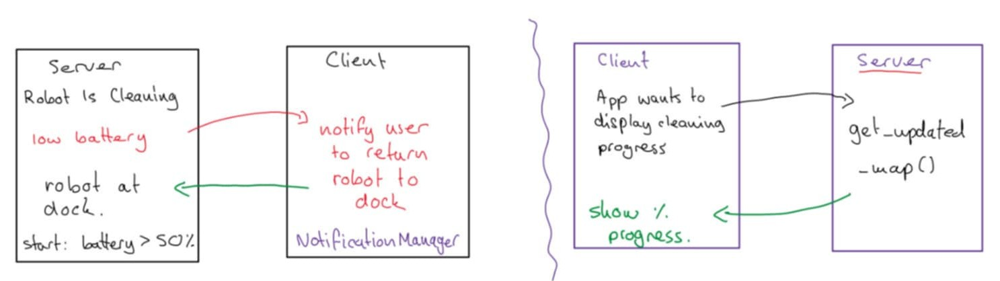
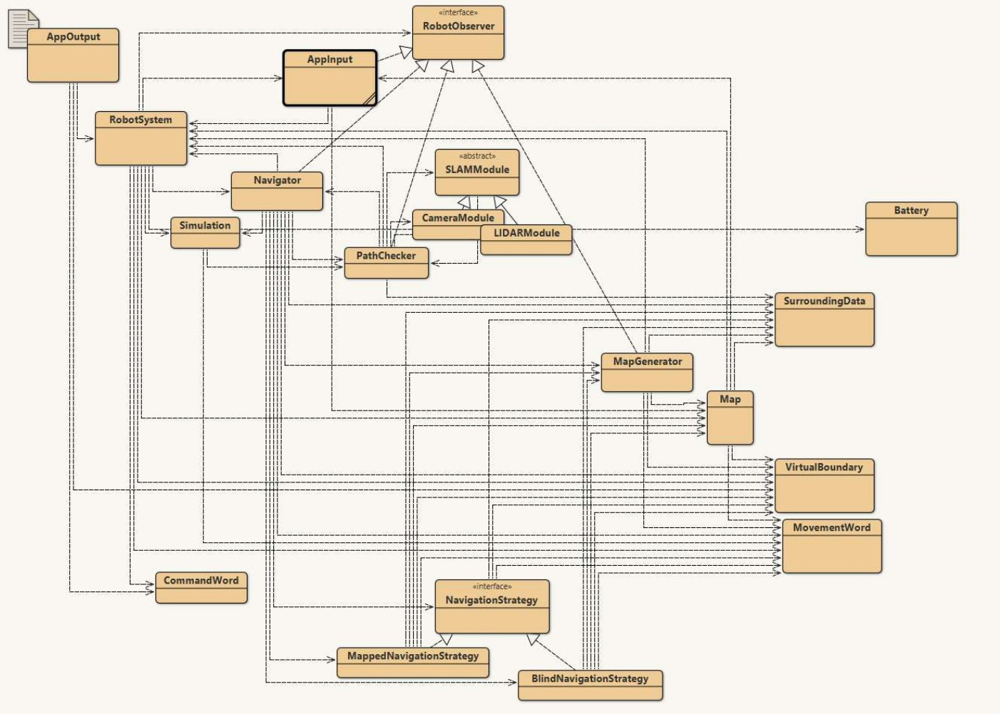
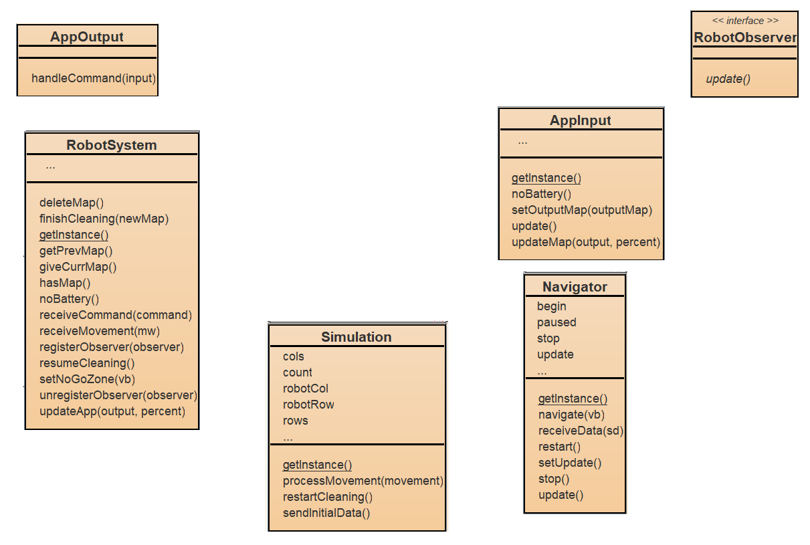
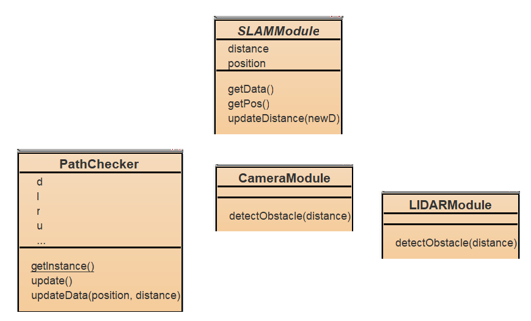
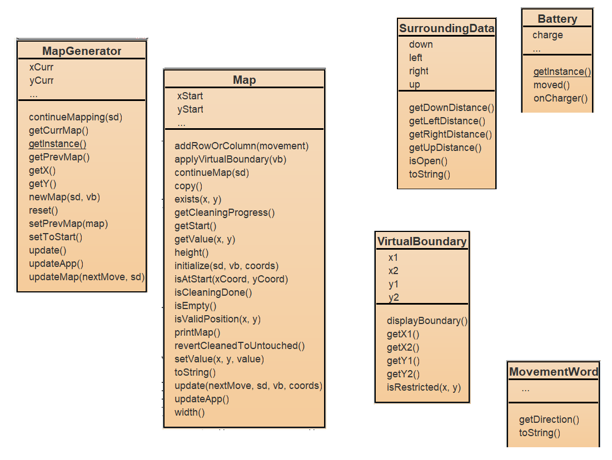
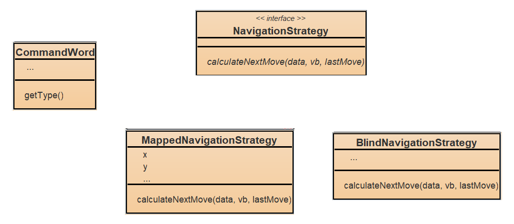
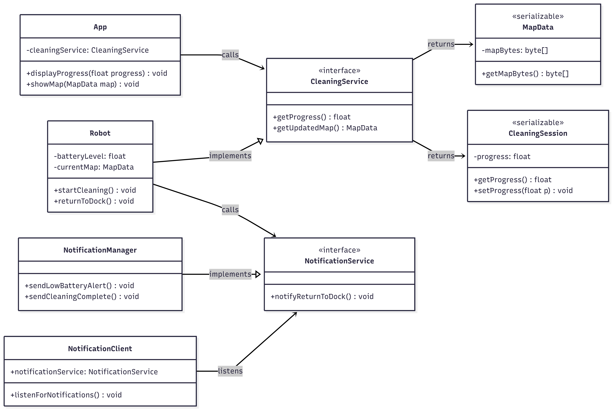

# Software Engineering (SE) Lab 5-6 Report on Distributed UC-cluster Demonstrator of OR Firmware team

### Authors

| Family name | First name(s) | Student ID | *Partner* |  
| --- | --- | --- | --- |
| Im | Brian | 2827056 | Partner B (Robot Firmware)|

### Version 
WIP

**Deadlines for this document**

- lab 5 preparation: Sunday, June 8
- lab 5 final version - DEADLINE: Sunday, June 15
- lab 6 prep version: Saturday, June 21
- lab 6 final version - DEADLINE: Friday June 27 


***Prerequisites:***

| What you check/do now | Why and for what pupose |
 | --- | --- |
| Lab 4 task sheet | *Checking if your UC-cluster demonstrator fulfills the requirements*  |
| Design Patterns Code as demonstrator examples for single pattern UC | *Checking your lab 4 final code version*| 
| git pulled | get last version of your partners work
| report 5 pushed | this document renamed and pushed by one of the partners |

**"SE-lab5-Report_*team-Number_AorB_names-of-the-two*"**, upload it (first time by one partner) to gitlab or pull it (later) and commit changes continuously! 

***Tasks***:
- Fulfill Prerequisites (above) **FIRST**!
- Partners provide an original report contribution without plagiarism. *If you use AI tools, give in appendix a Keyword and section of this document, then a list of your inputs to the AI prompt*
- Transfer suitable content from lab 3-4: Check if your UC-cluster demonstrator and source code fulfill the requirement, refine it if ncessary and paste it in section 1 of this document.

## Glossary

*This glossary only contains terms related to the application domain. A glossary of SE-related terms is placed into appendix A*

| Term | Acronym | Description |  
| --- | --- | --- |
| Robot Mower | RM | Robotic Lawn Mower |
| Robot Vacuum | RV | Robotic Vacuum Cleaner |
| ... | ... | ... |

## 1. Base documents

### 1a. UC cluster

Taken from the app report due to being the same.
  

  

### 1b. Design Patterns

#### Observer Pattern

**Description(Map):**
`RobotSystem` stores `Navigator`, `AppInput`, `PathChecker` and `MapGenerator` as observer objects to be notified when a clean has been completed. This allows for easy moditications on which classes are notified while keeping their execution synchronous but logically separate.

#### Strategy Pattern

**Description:**
`Navigator` requests `RobotSystem` for available map data. Depending on whether the `RobotSystem` returns a valid map the `Navigator` selects either a Map Strategy or a No Map Strategy. These two strategies, as subclasses of Strategy, contain different algorithms and handle the movement behaviours of the robot. This approach allows the `Navigator` to dynamically adapt to different contexts, ensuring flexible movement logic.

#### Singleton Pattern

**Description:**
These four classes only require a singular instance for proper functionality of the robot vacuum firmware. These classes represent core subsystems that should never exist in duplicate to avoid state conflicts or duplication of effort. Additionally solves the issue of having classes store instances of other classes to send information and requiring the passthrough of itself when constructing other classes.

### 1c. UC-Diagram with properties/fields and methods



Due to the overcrowded and unreadability of adding the methods and fields to the diagram, it is in this report separately below. It has been separated into 4 sections and each part somewhat corresponds to the location of the class on the diagram.






The event source is from the App through the RMI or throught the AppOutput class. The `main()` of the server begins and observers are attached, which are the clients. Then the client can a requent to being cleaning. It begins the process of the autonomous navigation from RobotSystem and initialises the sending of simulated sensor data from the Simulation class to the 8 different sensors.

## 2. Client-Server (CS) Demonstrator Basics

### 2.1 Funktionality

The robot takes the server role in this system because it is responsible for providing the core services or functionality that the client interacts with. It fulfills the fits the role of the server as it receives request, sends back data and adapts its behaviour according to the data sent by the app/client. 

UCs affected by the C-S Demonstrator:
1. UC-17: Control Robot
   - The app will send remote commands to start, stop, or dock the vacuum. These commands are sent via RMI from the app to the robot.
2. UC-19: Voice Control
   - Voice commands issued from the app to the robot are sent via RMI. The app sends a command like "start", "stop", or "pause" and the robot processes it.
3. UC-20: Update Firmware
   - The app sends a request to the robot to start the firmware update process remotely.
4. UC-22: Adjust Cleaning Intensity
   - The app will send commands to adjust the suction power or cleaning intensity remotely.
5. UC-23: Quick Boot
   - The app can remotely confirm the status of the robot and begin cleaning quickly.
6. UC-24: Automatic Mapping
   - The app receives the completed map of the floor after a clean is completed.
7. UC-31: Scheduled Cleaning
   - The app sends a new schedule to the robot which initiates a clean at the specified time.

### 2.2 Provision and CS-Separation of Classes



The classes necessary to be implemented on the server side from the app are the three notification classes, `NotificationManager` and `NotificationService` in addition to the cleaning class, `CleaningService`. Additionally, a shared MapData class between the server and client is required.

## 3. Client-Server Contract

### 3.1 Conceptual understanding

In procedural communication systems the client and server need to define common interfaces such that both systems can understand and process the information received properly. THe common interfaces ensures that the methods and data exchanged between them are standardized, making the communication reliable and predictable.

The client-server contract defines the communication protocol between the client and the server. The client invokes methods defined in the server’s interface, while the server implements these methods to perform actual computations and return the results. This design aligns with coupling and common interface principles, allowing the two components to communicate effectively without tightly coupling the client and server implementations.

Interfaces in a distributed object system define the remote methods the client can invoke on the server object. This is to ensure that the client and server maintain a low level of coupling. Classes in the provide the actual logic to handle the method calls. These classes are responsible for executing the necessary logic when a method is called.

### 3.2 Client-Server Interfaces

On the Firmware/Server there are three interfaces defined. AppRemoteObserver, FirmwareRemote and RobotObserverRemote. This is to implement the observer pattern on teh java RMI in interacting with the App/Client.

## 4. Technical realization with Java RMI (Lab 5)

### 4.1 Technical Understanding

a. java.rmi.Remote

An interface or class must be declared as `java.rmi.Remote` if it is to be called remotely. This allows the class or interface to be capable of remote communication using RMI.

Example:
```java
import java.rmi.Remote;
import java.rmi.RemoteException;

/**
 * Remote Interface.
 * This is the functionality contract aggreed by 
 * Server to provide 
 * and Client to use!
 *
 * @author Wolfgang Renz
 * @version May 2025
 */
public interface  MessageWriter  extends Remote {

    /**
     * Method writeMessage
     *
     * @throws RemoteExceptions
     * @param s the message to be written by the server
     */
    void  writeMessage(MyMessage s)  throws RemoteException ;
}
```
This interface is defined on the server-side and provides the contract for the server to implement, thus allowing the client to invoke remote methods on the server.

b. java.io.Serializable

In distributed systems using RMI, objects must be serialized in order to be transmitted over the network. We can use Java's serialization mechanism, `java.io.Serializable`, to convert objects into a byte stream so they can be sent over the network.

Example:
```java
import java.io.Serializable;

/**
 * MyMessage object is communicated via middleware, 
 * therefore to bedeclared as Serializable
 *
 * @author Wolfgang Renz
 * @version May 2025
 */
public class MyMessage implements Serializable
{
    // instance variables - replace the example below with your own
    private String msg;

    /**
     * Constructor for objects of class MyMessage
     */
    public MyMessage(String message)
    {
        // initialise instance variables
        msg= message;
    }

    @Override
    public String toString()
    {
        // put your code here
        return msg;
    }
}
```

This is required on the client-side and server-side for any object that needs to be passed as a parameter or return value in remote method calls.

c. java.rmi.UnicastRemoteObject

The class `java.rmi.server.UnicastRemoteObject` is used to make a remote object available for remote method invocation. It provides the functionality to export the object so it can be accessed from another JVM over RMI.

Example:
```java
import java.rmi.RemoteException;
import java.rmi.server.UnicastRemoteObject;

public class MessageWriterImpl extends UnicastRemoteObject
implements MessageWriter {
    public MessageWriterImpl() throws RemoteException {
    }

    public void writeMessage(MyMessage s) throws RemoteException {
        System.out.println("serializable object unmarshalled: "+s.toString()) ;
    }
}
```

This is used on the server-side for all remote objects that need to be called remotely by clients. By extending UnicastRemoteObject, the server class is automatically exported and made available to handle remote invocations.

d. to be exported by calling rebind

Once an object is created and made available for remote calls, it needs to be bound to the RMI registry, so the clients can look it up and invoke its methods. The method `rebind` in the RMI registry is used for this purpose.

Example:
```java
import java.rmi.registry.LocateRegistry;
import java.rmi.registry.Registry;
import java.rmi.RemoteException;
import java.rmi.server.RemoteServer;
import java.rmi.server.UnicastRemoteObject;

public class HelloServer {
    public HelloServer() throws RemoteException
    {
        Registry registry = LocateRegistry.getRegistry();
        registry.rebind( "MessageWriter", new MessageWriterImpl() );

        System.out.println( "MessageWriter registered" );
    }

    public static void startRegistry() throws RemoteException
    {
        LocateRegistry.createRegistry( Registry.REGISTRY_PORT );
        RemoteServer.setLog( System.err ); 
    }

    public static void main(String [] args) {
        try{
            new HelloServer();
        }
        catch(RemoteException re){
            re.printStackTrace();
        }
    }
}
```

This is used on the server-side to bind remote objects to the registry. This allows the client to later look up the object by this name.

### Pt.2

In a distributed system using Java RMI, methods that are defined in a remote interface need to declare that they throw a `RemoteException`. This exception is a checked exception that indicates a failure or issue occurred during the remote communication process, such as network problems, timeouts, or server unavailability. This is required as the RMI communicates over a network between JVMs, a `RemoteException` is used to indicate these failures. 

Here are some common examples of where `RemoteException` can be implemented:
1. Remote method calls: Any method invoked remotely must be capable of throwing a RemoteException because network-related failures can occur during the communication between client and server.
2. Server-side methods: Methods implemented on the server that are invoked by remote clients will also throw RemoteException if something goes wrong with the communication.
3. Client-side RMI invocations: When the client invokes remote methods on the server, the methods may throw RemoteException if the communication fails.

### Pt.3

The RMI Registry is a naming system in a RMI-based distributed system. It allows remote objects to be registered by a unique name and then looked up by client applications. It can be viewed as like a directory that links between a given name and a corresponding remote object intance. This allows for the client to be unaware of where the remote object is located as it can be accessed simply with its name.

In RMI, the proxy object is shared across all clients which effectively results in a usage similar to the Singleton Pattern. As a result, the server side class that is accessed through the RMI does not need to separately implement the Singleton Pattern. 

### 4.2 Colored Class Diagram

*Colors shall indicate a. - d.(including look-up) from 4.1 above"

## 5. Design for MOM-based Demonstrator (Lab 6 prep)

## 6. Technical realization with JMS and ActiveMQ (lab 6)

### References


## Appendix A (SE Glossary)

| Term | Acronym | Description |  
| --- | --- | --- |
| Concept | - | Prototypic class in domain model without methods |
| Boundary Concept | - | receives or sends events from or to external actors |
| Knowing Concepts | - | Data classes |
| Association | - | to be done ... |
| Domain Model | DM | Based on Responsibilities, concepts are defined (boundary or internal) with associations and properies |
| Design Pattern | - | to be done ... |
| Observer Pattern Reason | - | Varying aspect that requires this pattern, to be done ... |
| Decorator Pattern Reason | - | Varying aspect that requires this pattern, to be done ... |
| Strategy Pattern Reason | - | Varying aspect that requires this pattern, to be done ... |
| Command Pattern Reason | - | Varying aspect that requires this pattern, to be done ... |
| Factory Pattern Reason | - | Varying aspect that requires this pattern, to be done ... |

## Appendix B (AI support)

*If you used AI tools, give a Keyword and section of this document, then a list of your inputs to the AI prompt*