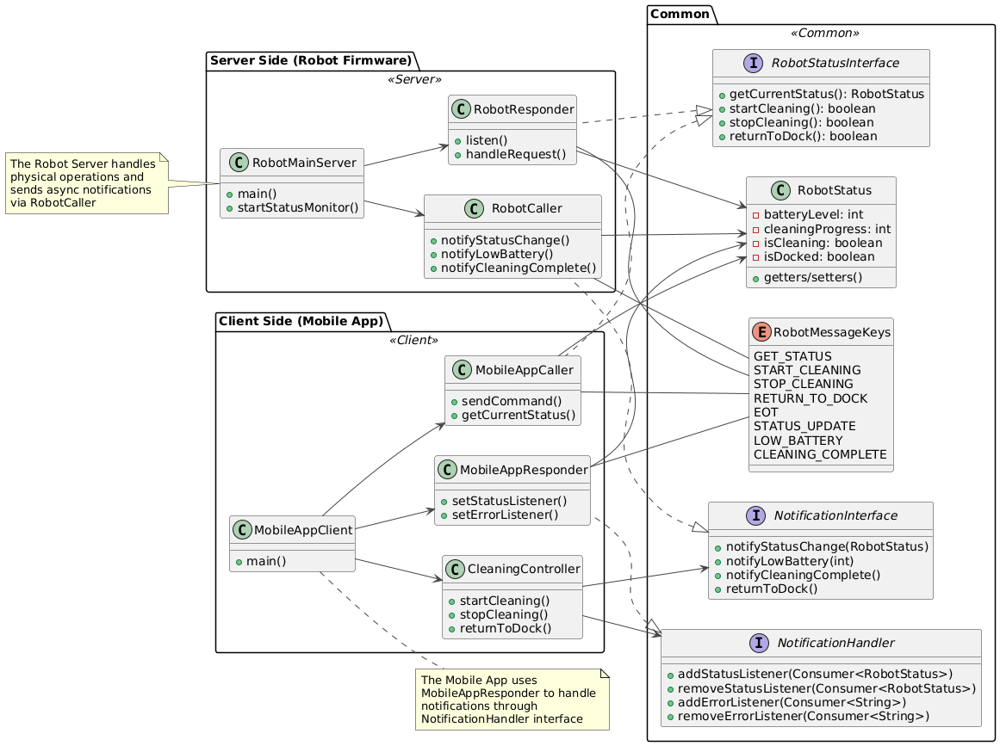
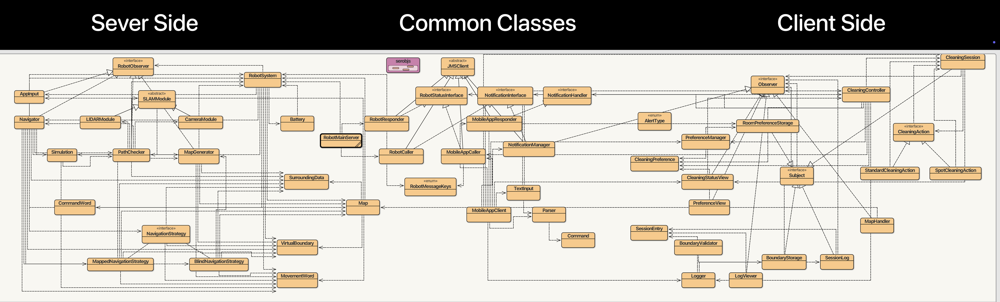
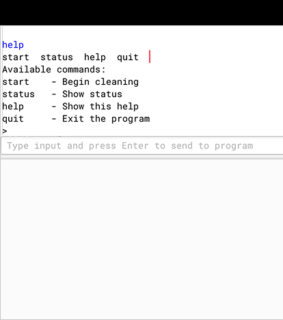
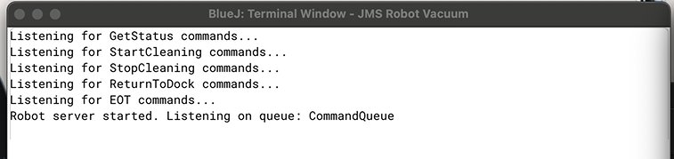
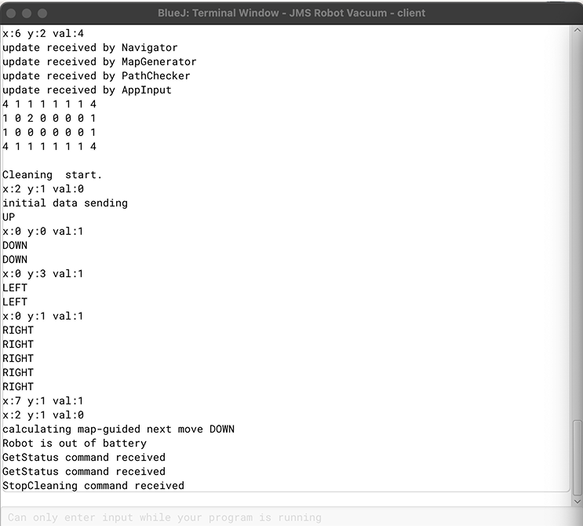
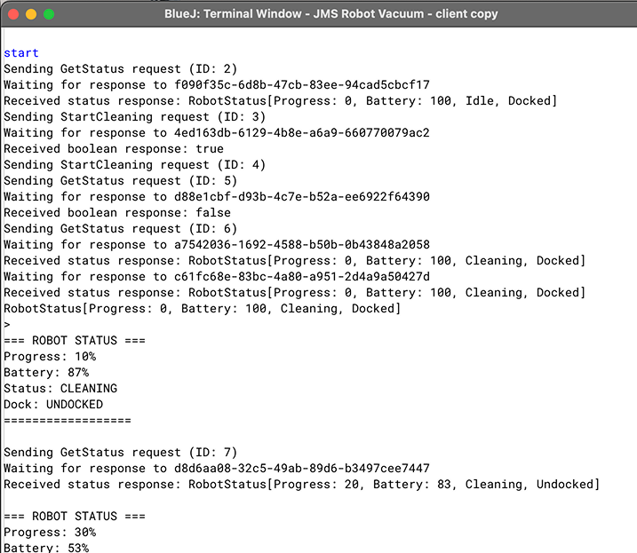
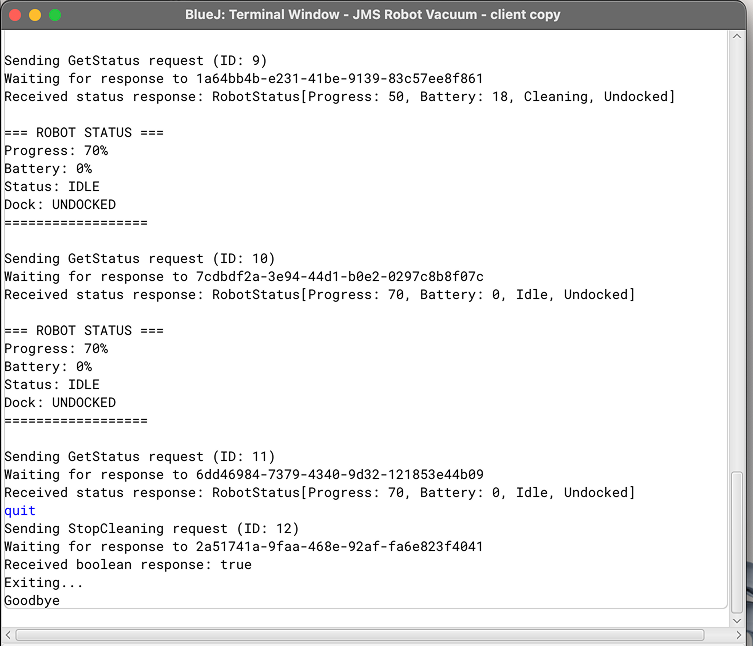

## 5. Design for MOM-based Demonstrator (Lab 6 prep)

### 5.1 Conceptual understanding

#### 5.1.1 What is the role of the message queue (MQ) in MOM?

The **Message Queue (MQ)** serves as the core middleware component in Message-Oriented Middleware (MOM), facilitating **asynchronous and decoupled communication** between distributed systems. It enables producers (senders) and consumers (receivers) to operate independently in both time and space, enhancing system robustness and scalability.

**Key Roles of MQ**:
1. **Decoupling** – Senders and receivers do not need to be online or active simultaneously.
2. **Persistence** – Messages can be stored until explicitly processed, allowing recovery from failure.
3. **Load Balancing** – Distributes work evenly across multiple consumers.
4. **Guaranteed Delivery** – Ensures message reliability through retries and acknowledgments.

**Example Use Case**:
In a robot control system, commands like `clean` or `moveTo` are enqueued. The robot retrieves and executes them when ready, without requiring the client to remain connected.

#### 5.1.2 Why is Class-Design of the JMS-distributed demonstrator very similar to that of the RMI-distributed demonstrator? What is identical? What are the differences? Name four of them!

Both JMS and RMI designs implement a **Client-Server architecture** that relies on a clearly defined **contract** (i.e., interface) for remote communication. Despite their underlying transport differences, their structure remains conceptually aligned.

**Identical Aspects**:

1. **Remote Interface Logic**  
   Both systems define a communication interface (`LaborkursInterface`, etc.) that abstracts method calls or message operations.

2. **Data Transfer Objects (DTOs)**  
   Serializable objects (e.g., `Student`, `RobotCommand`) are used to encapsulate data passed between client and server.

3. **Client-Server Separation**  
   The architecture maintains a clean division between invoker logic (Client/Caller) and processing logic (Server/Responder).

4. **Error Handling**  
   Both employ exception handling to manage remote failures: `RemoteException` in RMI, `JMSException` in JMS.

**Distinct Differences**

| **Aspect**         | **RMI**                           | **JMS**                            |
|--------------------|-----------------------------------|------------------------------------|
| Communication       | Synchronous (blocking)            | Asynchronous (non-blocking)        |
| Coupling            | Tight (direct references)         | Loose (message-based via broker)   |
| Middleware          | RMI Registry                      | ActiveMQ / JMS Broker              |
| State Management    | Stateful (connected sessions)     | Stateless (event/message driven)   |

#### 5.1.3 Name two MOM services! Which of them is best for which remote method calls?

1. **Message Service (Point-to-Point)**  
   - **Usage**: Ideal for **request-response communication** where exactly one consumer processes each message.  
   - **Best suited for**: Remote method calls like `submitApplication()` or `processPayment()`, where duplication must be avoided.  
   - **Example**: A robot receives a unique `cleanRoom` command, which should only be executed once.

2. **Event Service (Publish-Subscribe)**  
   - **Usage**: Designed for **broadcasting events** to multiple listeners.  
   - **Best suited for**: Informational updates such as `batteryLow` or `obstacleDetected`.  
   - **Example**: Multiple monitoring systems are notified simultaneously when a robot sends a `batteryLow` event.

### 5.2 Technical Understanding

#### 5.2.1 Package `javax.jms` does not contain any executable code. Why is it enough to standardize Interfaces in JMS? How are objects generated then? Give five examples of JMS-based object creation in my JMS-distributed examples, one line of code each!

The `javax.jms` package defines a set of **standardized interfaces** for Java-based Message-Oriented Middleware (MOM) systems. It does not provide executable code because its purpose is to decouple application logic from vendor-specific implementations. This design ensures:

- **Vendor Neutrality**: Different MOM providers (e.g., ActiveMQ, IBM MQ, RabbitMQ) can implement the same interfaces without altering client-side code.
- **Interoperability**: JMS-compliant applications can be ported across platforms with minimal changes.
- **Extensibility**: Developers can rely on a stable API while benefiting from enhancements provided by the underlying implementation.

Object instantiation is delegated to the **concrete JMS provider**, typically through the **Abstract Factory Pattern**. The provider registers and delivers factory classes capable of creating runtime objects such as connections, sessions, and destinations.

**Examples of JMS-Based Object Creation** (from the Laborkurs example):

```java
// 1. ConnectionFactory instantiation
ConnectionFactory factory = new ActiveMQConnectionFactory("tcp://localhost:61616");

// 2. Connection creation
Connection connection = factory.createConnection();

// 3. Session creation
Session session = connection.createSession(false, Session.AUTO_ACKNOWLEDGE);

// 4. Queue (destination) creation
Queue queue = session.createQueue("RobotCommandQueue");

// 5. MessageProducer creation
MessageProducer producer = session.createProducer(queue);
```

#### 5.2.2 Which components are JMS client, which JMS server? In which sequence do you need to start the components?

In a typical JMS-based distributed system, the distinction between **JMS clients** and the **JMS server** is defined by their roles in the message lifecycle:

* **JMS Server**: Refers to the MOM infrastructure (e.g., **ActiveMQ broker**) responsible for managing queues, topics, message routing, and persistence.
* **JMS Clients**: Application components that produce or consume messages using the standardized JMS API (e.g., `Caller`, `Responder`).

**Startup Sequence**:

1. **Start the JMS Broker** (e.g., ActiveMQ):

   ```bash
   ./bin/activemq start
   ```

2. **Launch the Server-Side Consumer**:
   This component listens for incoming messages (e.g., from `RobotCommandQueue`) and handles operations such as `ADD`, `LIST`, or `EOT`.

3. **Run the Client-Side Producer**:
   The producer sends appropriately structured messages to the queue, based on user input or automated triggers.

#### 5.2.3 How do you inspect sending and delivery of your messages in the message queue?

To verify message flow and monitor system behavior, several mechanisms can be used to inspect JMS message delivery:

1. **ActiveMQ Web Console**:
   Accessible at `http://localhost:8161/admin` using default credentials (`admin/admin`). The dashboard provides visibility into existing queues, message counts, consumers, and delivery status.

2. **Server Logs**:
   The ActiveMQ broker logs runtime information to `./data/activemq.log`, including message receipt, delivery status, and potential errors.

3. **Programmatic Queue Inspection**:
   Within the application, the `QueueBrowser` interface can be used to list pending (undelivered) messages:

   ```java
   QueueBrowser browser = session.createBrowser(queue);
   Enumeration<?> messages = browser.getEnumeration();
   while (messages.hasMoreElements()) {
       TextMessage msg = (TextMessage) messages.nextElement();
       System.out.println("Pending: " + msg.getText());
   }
   ```

### 5.3 Applied Analysis of Client-Server Design in RMI and JMS (Based on Lecture SE 09 and Laborkurs Examples)

Now consider "SE 09 Renz DistributedSystems2 MOM" lecture slide set and the RMI-  and JMS-Laborkurs example in my "Client-Server Examples Renz 5-18-6"!

#### 5.3.1 Which classes define here the C-S contract?

The contract is defined by:
 
- **`LaborkursInterface`**: declares the remote methods (`trageStudentEin`, `laborliste`, `eot`) implemented via JMS messages.
- **`MessageKeys` enum**: Defines the message types (`ADD`, `LIST`, `EOT`) corresponding to remote methods.
- **`Student` class**: Serializable payload for `ADD` messages.

#### 5.3.2 Why does Caller implement the LaborkursInterface? Which is the corresponding class in RMI-Laborkurs? If it is not visible, how could you make it visible? Cf. RMI slide set!
    
In JMS, `Caller` implements `LaborkursInterface` to mimic RMI's proxy pattern. It translates method calls into JMS messages (e.g., `trageStudentEin()` sends an `ObjectMessage` with a `Student`). This provides a familiar RMI-like API to the client (`Texteingabe`).

The RMI equivalent is the **client stub** (auto-generated by `rmic` or dynamically created). The stub also implements `LaborkursInterface` and forwards calls to the remote server.

#### 5.3.3 What is the reason to place the Student class in a serobjs package for JMS?What happens if you remove serobjs package from trusted packages in JMSClient class?

The `serobjs` package groups serializable objects (`Student`) to ensure they can be sent as JMS `ObjectMessage` payloads. This is a security best practice to restrict deserialization to trusted classes. 

If `serobjs` is removed from `JMSClient.setTrustedPackages()`, the JMS provider (ActiveMQ) will reject deserialization of `Student` objects, throwing a `SecurityException` or `JMSException`.

#### 5.3.4 Which mechanism is used in class Responder for defining specific message receivers each responsible for one of the remote message calls defined in the C-S interface? Hint: Check section 2 of the above slide set, which describes the MQ!

The Responder class utilizes JMS message selectors to handle messages corresponding to specific remote operations. Each consumer is configured with a selector expression that filters messages based on the custom Method property:

        ```java
        String selector = "(Method = 'ADD')";
        addConsumer = session.createConsumer(dest, selector);
        ```

This mechanism, discussed in Slide 55 of the SE 09 Renz DistributedSystems2 MOM lecture, ensures modular and maintainable message handling by delegating operation-specific logic to separate asynchronous listeners.

#### 5.3.5 What do the Lambda-Expressions in messageConsumer.setMessageListener() define and which Interface and method do they implement?

Lambda expressions used in `setMessageListener()` simplify the implementation of the `MessageListener` interface. Each lambda implicitly implements the `onMessage(Message msg)` method. For example:

```java
addConsumer.setMessageListener(msg -> {
    // Handle ADD message
});
```

is equivalent to:

```java
addConsumer.setMessageListener(new MessageListener() {
    @Override public void onMessage(Message msg) {
        // Handle ADD message
    }
});
```

#### 5.3.6 What is the difference between receiving messages in the JMS-Eliza example and receiving messages in the JMS-Laborkurs?
  
The primary difference between message reception in the JMS-Eliza and JMS-Laborkurs systems lies in their architectural design and handling of communication semantics. JMS-Eliza follows a minimalistic, synchronous request-response model, where the client sends a message and blocks while waiting for a reply via a temporary queue. This interaction is tightly coupled, using a single message consumer and relying on JMSCorrelationID for response matching. Message types are uniform—typically ObjectMessage for requests and TextMessage for replies—without filtering or operation-specific routing.

In contrast, JMS-Laborkurs implements a multi-operation interface inspired by remote method invocation, where each operation (e.g., ADD, LIST, EOT) corresponds to a distinct message handler. Message routing is achieved through JMS selectors, which allow the server-side Responder to register multiple consumers, each responsible for a specific method based on message properties. Messages are received asynchronously via setMessageListener, promoting a non-blocking, event-driven architecture that improves scalability and decouples logic per operation.

This design enables more granular control over processing logic and error handling. Each operation in Laborkurs can define its own payload structure and response behavior—such as returning a boolean status for ADD, a formatted string for LIST, or omitting a response for EOT. This contrasts with Eliza’s uniform text-based responses and centralized processing logic, which is simpler but less adaptable to extension or concurrent processing.

Overall, JMS-Eliza is suitable for demonstrating basic messaging concepts, whereas JMS-Laborkurs exemplifies a robust, modular, and scalable approach aligned with best practices for message-oriented middleware. It offers better support for concurrent operations, extensibility, and fault isolation through clearly separated message consumers and operation-specific handling.

#### 5.3.7 Consider the JMS Message structure as given in the lecture slide set! How is the above Responder-side mechanism supported in defining messages in the Caller?

In the JMS-Laborkurs system, the `Caller` constructs and configures JMS messages in a way that directly enables the server-side `Responder` to handle them correctly. This mechanism is based on how the message headers, properties, and body are defined according to the structure outlined in the lecture slide set (particularly slides 40–41, 55 of SE 09 Renz DistributedSystems2 MOM).

The message structure set by the `Caller` includes essential headers such as `JMSReplyTo` and `JMSCorrelationID`. The `JMSReplyTo` header specifies the temporary queue where the client expects the response, while `JMSCorrelationID` serves as a unique identifier for matching requests and replies, especially in concurrent environments. These headers establish a direct communication channel and allow correct correlation between outgoing requests and incoming responses.

A crucial addition is the custom message property `"Method"`, which encodes the operation to be executed (e.g., `ADD`, `LIST`, or `EOT`). This property is not part of the JMS standard headers but is used by the `Responder` in conjunction with JMS selectors to filter and dispatch incoming messages to the appropriate handler. For example, a message with `Method = "ADD"` will be consumed only by a consumer registered with the corresponding selector. This routing strategy avoids central dispatch logic and allows scalable and modular handling of different operations.

In terms of message body, the `Caller` varies the message type according to the operation's semantics. The `ADD` operation uses an `ObjectMessage` containing a serialized `Student` object, while `LIST` and `EOT` are sent as `TextMessage` instances with simple command strings. The `Responder` distinguishes these types at runtime and processes them accordingly. This pattern aligns with the JMS model in which both headers and payload are interpreted to determine behavior on the receiving side.

Overall, this design supports a loosely coupled, operation-specific interaction model. The message itself becomes a self-describing unit of communication, enabling the `Responder` to route, interpret, and respond to client requests in a modular and asynchronous fashion—an approach that embodies the principles of Message-Oriented Middleware as discussed in Section 2 of the lecture.

#### 5.3.8 Why is there only a client side Caller and a server side Responder here?

In the JMS-based architecture, both client and server components are technically JMS clients (as per Slide 38 of SE 09 Renz DistributedSystems2 MOM Lecture). The `Caller` acts as the client-side proxy, sending structured messages, while the `Responder` listens on a queue and processes those messages. There is no need for RMI-style stubs or skeletons since all communication is abstracted via the message queue. This simplifies deployment and enhances modularity, while preserving the logical structure of remote invocation.

### 5.3	Design of the your MOM-based C-S-demonstrator

- Server side: *App or the Robot Firmware?*
- Classes of the C-S contract:
*Interface definitions and corresponding MessageKeys!*
*DTO class(es) with instance variables, i.e. object properties!*
- caller and responder classes: *for each of the Interfaces*
 *Be aware of the fact that such classes can implement more than one Interface!*

#### JMS Architecture for Robot Vacuum Cleaner System

##### 1. Introduction

This document presents the software architecture of a robot vacuum cleaner system developed as part of the Software Engineering Lab. The system implements an executable JMS-based Client-Server (C-S) demonstrator for the UC-cluster, where the distributed design (class diagram) was initially validated in Lab 5 using an RMI-based prototype: [RMI BlueJ Code](./RMI%20Robot%20Vacuum/). In the current system, RMI stub classes have been replaced by JMS-based Caller and Responder components, preserving the architecture while introducing asynchronous, decoupled message-based communication using Java Message Service (JMS) and Apache ActiveMQ. The architecture ensures reliable interaction between the robot firmware and the mobile application.

##### 2. System Overview

The system is composed of three primary components:

- **Firmware**: Runs on the robot hardware and manages robot operations and states.
- **Mobile Application**: Provides a user interface for remote control and monitoring of the robot.
- **Middleware (JMS-based)**: Facilitates communication between the firmware and the mobile application through messaging.

##### 3. Architecture Structure

##### 3.1 Server and Client Roles

- **Server Side**:  
  The **Robot Firmware** acts as the server. It manages the robot's state and executes commands received from clients.

- **Client Side**:  
  The **Mobile Application** functions as the client. It sends commands to the robot and receives status updates or notifications.

##### 3.2 Core Components

###### Common Components (Shared Between Client and Server)

- **RobotMessageKeys**: Enumeration defining all message types exchanged within the system.
- **RobotStatus**: A serializable Data Transfer Object (DTO) that encapsulates the robot's current state.
- **RobotStatusInterface**: Interface specifying operations related to retrieving or modifying the robot’s status.
- **NotificationInterface**: Interface used for handling event-driven notifications, including errors and status changes.
- **NotificationHandler**: Interface for managing registration and removal of listeners for asynchronous status updates and error notifications, enabling decoupled event handling on the client side.

###### Server Side Components (Firmware)

- **RobotServer**: Main server class responsible for managing client connections and overall server behavior.
- **RobotResponder**: Handles incoming requests from clients and executes corresponding actions on the robot.
- **RobotCaller**: Responsible for sending asynchronous status updates and event notifications to subscribed clients.

###### Client Side Components (Mobile Application)

- **AppClient**: Main client class that initializes communication and user interactions.
- **AppResponder**: Processes asynchronous notifications and updates received from the server.
- **AppCaller**: Sends commands to the server to control robot operations or request status updates.

##### 3.3 Detailed Component Specifications

###### RobotMessageKeys (Enumeration)

Defines the available message types for communication between client and server.

```java
public enum RobotMessageKeys {
    GET_STATUS,
    SET_MODE,
    START_CLEANING,
    STOP_CLEANING,
    RETURN_TO_DOCK,
    STATUS_UPDATE,
    ERROR_NOTIFICATION,
    BATTERY_LEVEL_UPDATE,
    CLEANING_PROGRESS_UPDATE,
    EOT
}
```

###### RobotStatus (Data Transfer Object)

Encapsulates the robot’s operational state and status information.

```java
public class RobotStatus implements Serializable {
    private String currentMode;
    private int batteryLevel;
    private boolean isCharging;
    private boolean isCleaning;
    private boolean isDocked;
    private int cleaningProgress;
    private String currentError;
    // Getters and setters
}
```

###### RobotStatusInterface

The `RobotStatusInterface` defines operations for client-to-server communication, enabling remote control and status monitoring of the robot vacuum cleaner. It is implemented by `AppCaller` (client) and handled by `RobotResponder` (server).


```java
public interface RobotStatusInterface {
    RobotStatus getCurrentStatus() throws JMSException;
    boolean startCleaning() throws JMSException;
    boolean stopCleaning() throws JMSException;
    boolean returnToDock() throws JMSException;
    void eot() throws JMSException;
}
```

###### NotificationInterface
Defines the notification interface for server-to-client communication. Implemented by the RobotCaller (server) and handled by AppResponder (client).

```java
public interface NotificationInterface {
    void notifyStatusChange(RobotStatus status) throws JMSException;
    void notifyLowBattery(int batteryLevel) throws JMSException;
    void notifyCleaningComplete() throws JMSException;
    void returnToDock() throws JMSException;
}
```

###### NotificationHandler
The NotificationHandler interface defines a standardized mechanism for registering and removing listeners for robot status updates (RobotStatus) and error notifications (String messages) in the vacuum cleaner system. It follows the Observer pattern, allowing decoupled components—such as UI controllers—to react to asynchronous events without direct dependencies. Using Java’s type-safe Consumer functional interface, it provides flexibility for subscribing to real-time status changes like battery level or cleaning progress, as well as handling error alerts. This promotes clean separation of concerns, facilitates dynamic listener management, and simplifies testing and maintenance across the client-side architecture.

```java
public interface NotificationHandler {
    void addStatusListener(Consumer<RobotStatus> listener);
    void removeStatusListener(Consumer<RobotStatus> listener);
    void addErrorListener(Consumer<String> listener);
    void removeErrorListener(Consumer<String> listener);
}
```

##### 4. Caller and Responder Design

##### 4.1 Server Side

- **RobotResponder**  
  - Implements `RobotStatusInterface`.  
  - Handles synchronous requests from the mobile application, such as `GET_STATUS`, `SET_MODE`, `START_CLEANING`, and others.

- **RobotCaller**  
  - Implements `NotificationInterface`.  
  - Acts as the client-side receiver for asynchronous server notifications
  - Uses JMS message listeners to handle incoming updates

##### 4.2 Client Side

- **AppCaller**  
  - Implements `RobotStatusInterface`.  
  - Sends synchronous commands to the server, such as starting cleaning or querying the robot’s status.

- **AppResponder**  
  - Implements `NotificationHandler`.  
  - Listens for asynchronous messages from the server, including battery updates, error notifications, and progress updates.

##### 5. Communication Flow

##### 5.1 Command Flow (Client to Server)

1. The user interacts with the mobile app.
2. The app invokes `AppCaller`, which sends JMS messages with commands such as `START_CLEANING` or `RETURN_TO_DOCK`.
3. The server-side `RobotResponder` receives these commands, processes them, and updates the robot state accordingly.

##### 5.2 Notification Flow (Server to Client)

1. The robot detects any state change (e.g., battery status, completion of a cleaning task, or an error occurrence).
2. The server-side `RobotCaller` sends a notification message through JMS.
3. The client-side `AppResponder` receives this message and updates the app interface with the new status or error message.

##### 5.3 System Architecture



### 5.4 BlueJ Class Diagram

*Edit your BlueJ class diagram so that server side is left, client side right and common classes in the middle, or the other way round.*

BlueJ Class Diagram: [BlueJ Code](./JMS%20Robot%20Vacuum/)

## 6. Realization with JMS and ActiveMQ (lab 6)

### 6.1 Final BlueJ Class Diagram

*Edit your BlueJ class diagram so that server side is left, client side right and common classes in the middle, or the other way round.*

The final architecture of the Robot Vacuum Cleaner System has been carefully structured to highlight the clear separation of concerns between the Server Side, Client Side, and Common Classes. This visual and logical organization ensures modularity, maintainability, and effective communication via JMS middleware.

- On the **left**, the **Server Side** encapsulates all robot-internal logic for real-world interaction and autonomous behavior:
  - Core components such as `SLAMModule`, `LIDARModule`, `CameraModule`, and `MapGenerator` handle environment perception and mapping.
  - Navigation logic is implemented via `Navigator` and multiple `NavigationStrategy` variants (`MappedNavigationStrategy`, `BlindNavigationStrategy`) for flexible path planning.
  - `RobotSystem` represents the main orchestrator coordinating hardware modules, simulation, and decision-making.
  - `RobotResponder` processes incoming JMS commands from the mobile app, interfacing directly with `RobotSystem`.

- In the **center**, **Common Classes** establish shared functionality and client-server communication contracts:
  - `RobotStatusInterface` and `NotificationInterface` define standardized operations for status retrieval and event notifications.
  - `NotificationHandler` provides a decoupled event listener mechanism for asynchronous status and error updates.
  - `JMSClient` serves as the base class encapsulating JMS connection setup and messaging logic, used by both `RobotCaller` (server side) and `MobileAppCaller` (client side).
  - `RobotMessageKeys` enumerates all permitted message types, ensuring strict, type-safe communication.
  - `NotificationManager` centralizes handling of status change and error events across the system.
  - `MobileAppResponder` implements `NotificationHandler`, bridging server-originated messages to the client application.
  - Data classes like `RobotStatus`, `Map`, and preference-related objects maintain consistency across both sides.

- On the **right**, the **Client Side** governs all mobile application functionality for user interaction and remote control:
  - `CleaningController`, `CleaningSession`, and associated `CleaningAction` classes manage execution of cleaning tasks and user-issued commands.
  - `RoomPreferenceStorage` and `PreferenceManager` store persistent user preferences for cleaning behavior and map boundaries.
  - View components such as `CleaningStatusView`, `PreferenceView`, and `MapHandler` provide graphical feedback and controls.
  - `Observer` and `Subject` interfaces implement an internal observer pattern for efficient UI updates.
  - `SessionLog` and `BoundaryStorage` track historical data and cleaning boundaries for analysis and validation.
  - Auxiliary utilities like `Logger`, `LogViewer`, and `AlertType` support diagnostics, alerts, and user feedback.

This final architecture emphasizes decoupling between components, reliable asynchronous communication via JMS, and separation of real-time robot control from user-facing mobile application logic.



Final BlueJ Class Diagram: [Final BlueJ Code](./JMS%20Robot%20Vacuum/)

### 6.2 Demonstrator Input and Output

*GUI screenshot if avaiabile*

*User input and/or menue*

*Terminal Output Server Side*

*Terminal Output Client Side*

#### GUI Screenshot

*Include a screenshot of the mobile app interface if available.*

The user interacts with the system through a terminal-based menu on the client side. The following commands are available:

- `start` — Begin a new cleaning session.
- `status` — Display the current status of the robot vacuum (e.g., active, idle, completed).
- `help` — Show a list of available commands and their descriptions.
- `quit` — Exit the application.

These commands allow the user to manage the robot’s cleaning sessions and monitor progress through a simple command-line interface.



#### Terminal Output – Server Side

The screenshots below show the terminal output of the **Robot Server**:

- The first screenshot captures the server **initializing and starting to listen** to the message queue for incoming commands from the client. In this stage, the server:
  - Connects to the ActiveMQ broker
  - Registers message consumers for supported commands:
    - `GetStatus`
    - `StartCleaning`
    - `StopCleaning`
    - `ReturnToDock`
    - `EOT` (End-of-Transmission)
  - Listens for client requests on the `CommandQueue`

The server remains in this state, ready to handle incoming messages from the Mobile Application Client asynchronously via JMS.

  

- The second screenshot shows the server's response **after the User Input Start on the MobileAppClient side**, showing all the console output after starting and successful connection to the system.

Key events in this stage:
  - Environment map updates received by internal components (Navigator, MapGenerator, etc.)
  - Robot movement decisions displayed (e.g., UP, DOWN, LEFT, RIGHT)
  - Cleaning progress and map-guided navigation visible
  - Battery status and system alerts (e.g., "Robot is out of battery")
  - Server confirmation of received commands such as `GetStatus` and `StopCleaning`



#### Terminal Output – Client Side

The following screenshots present the terminal output from the **Mobile App Client**:

- In the **first screenshot**, the user enters the `start` command. The client sends a `StartCleaning` request and receives several status updates from the robot vacuum, including progress, battery level, and docking status. These responses show the robot transitioning from an idle to a cleaning state, with real-time feedback on its operation.

  

- In the **second screenshot**, the user enters the `quit` command. The system sends a `StopCleaning` request to the server, receives confirmation, and then exits gracefully. This demonstrates a complete user session, from initiating a cleaning task to shutting down the client.



#### Demo Video

[Click here to watch the demo](images/demo.mp4)

The demo video provides a full walkthrough of the robot vacuum system in action. It includes **subtitles** for clarity and demonstrates two devices connected to the **same local network**:

- One device runs the **Robot Server**, simulating the behavior of the robot firmware.
- The other device runs the **Mobile App Client**, which allows the user to send commands, monitor the robot’s status and receive notifications about it.

The video effectively illustrates how the distributed system functions in real-time, showcasing bi-directional communication and the flow of data between the robot hardware and the client interface.

## Appendix A (SE Glossary)

| Term | Acronym | Description |  
| --- | --- | --- |
| Concept | - | Prototypic class in domain model without methods |
| Boundary Concept | - | receives or sends events from or to external actors |
| Knowing Concepts | - | Data classes |
| Association | - | Relationship between concepts (e.g., `Robot` *has-a* `Battery`). Cardinality: 1-to-1, 1-to-many (e.g., `Robot` → `1..*` `CleaningZone`). |
| Domain Model | DM | Based on Responsibilities, concepts are defined (boundary or internal) with associations and properies |
| Design Pattern | - | Reusable solution to common problems. Standardizes communication between objects (e.g., Observer for event handling). |
| Observer Pattern Reason | - | Varying Aspect: Decoupling event sources from subscribers. Allows multiple apps to receive real-time robot updates (battery/map changes) without tight coupling. |
| Decorator Pattern Reason | - | Varying Aspect: Dynamic notification extensions. Adds sound/vibration to alerts without modifying core UI code (e.g., `SoundDecorator` wraps `BasicNotification`). |
| Strategy Pattern Reason | - | Varying Aspect: Interchangeable algorithms. Lets robot switch cleaning modes (e.g., `QuickClean` vs. `DeepClean`) at runtime via `CleaningStrategy` interface. |
| Command Pattern Reason | - | Varying Aspect: Networked action queuing. Encapsulates user commands (e.g., `StartCleaningCommand`) as serializable objects for reliable RMI transmission. |
| Factory Pattern Reason | - | Varying Aspect: Object creation variability. Centralizes instantiation of related objects (e.g., `NotificationFactory` creates `SoundNotification`/`VisualNotification`). |

## Appendix B (AI support)

*If you used AI tools, give a Keyword and section of this document, then a list of your inputs to the AI prompt*

**Keyword: General Formatting Support**

Prompt:
“Can you convert this lab explanation into a well-formatted markdown .md file with proper academic style?”